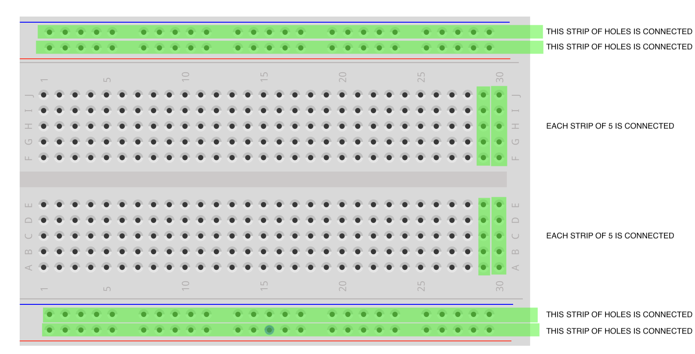
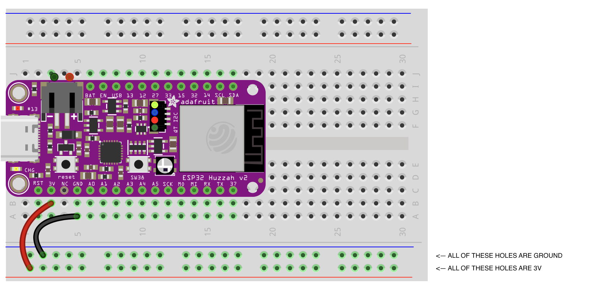

# Breadboards

In order of ease of use, and reverse order of permanency, circuits can be made on a breadboard, soldered onto a prototype board, or printed (a PCB, "Printed Circuit Board"). 

Breadboards are awesome because they let us work through our ideas quickly and reward experimentation. Wires can sometimes pop loose, but that's a small price to pay for not having to undo soldered connections to change something.

The following image shows how breadboards create hidden connections between their holes—you can connect components together simply by plugging them into adjacent holes, according to this scheme:

## Power Rails

With the ESP32 in place on the breadboard, there are at most two holes next to 3V and GND. But what if you want to hook up twelve knobs and switches?

The solution is to use "power rails." By attaching short jumper cables from the 3V and GND rows to the outside strips of the breadboard, you will have plenty of options for getting power and ground to your components.

