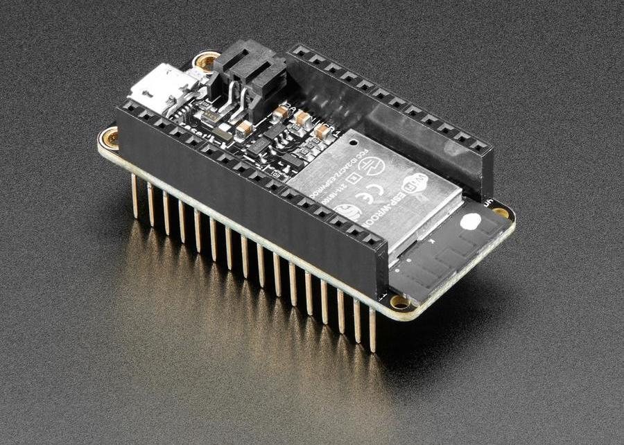

# Microcontrollers and the ESP32

A microcontroller is, in essence, a computer. The primary difference is that a computer is a general purpose machine with an operating system (like MacOS or Windos) that runs multiple programs, but a microcontroller only runs one program. That program usually functions as the logic within an electrical circuit that includes other hardware components, like sensors and motors. As such, rather than being contained within a sleek box with a monitor and keyboard, a microcontroller has its parts exposed so that circuits can be built around it. As artists, the advantage to using a microcontroller is that we can build them into our own custom projects that combine basic parts into new forms that go well beyond what is possible with pre-made systems.

The particular microcontroller that we will be using is the ESP32 mounted on a Feather breakout board. The ESP32 is the name of the chip itself, and a "breakout board" makes its pins accessible for prototyping and experimenting. It includes a jack for connecting to the computer and one for hooking up a battery, both of which make our lives much easier. "Feather" is a brand name from a company called [Adafruit](https://adafruit.com), which is based in New York City and is a primary source of electronics components for many artists.

To begin, get your ESP32, a breadboard, and a USB cable that matches your laptop.