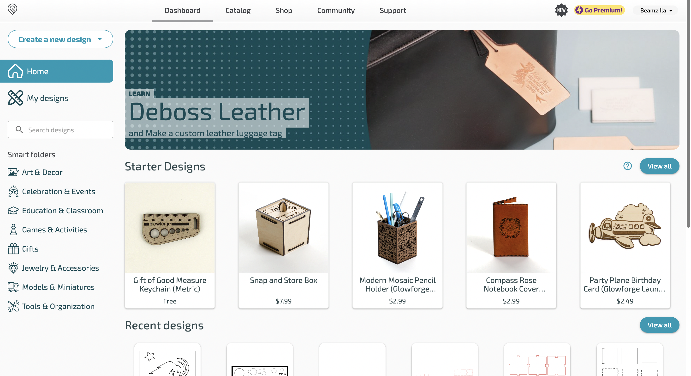
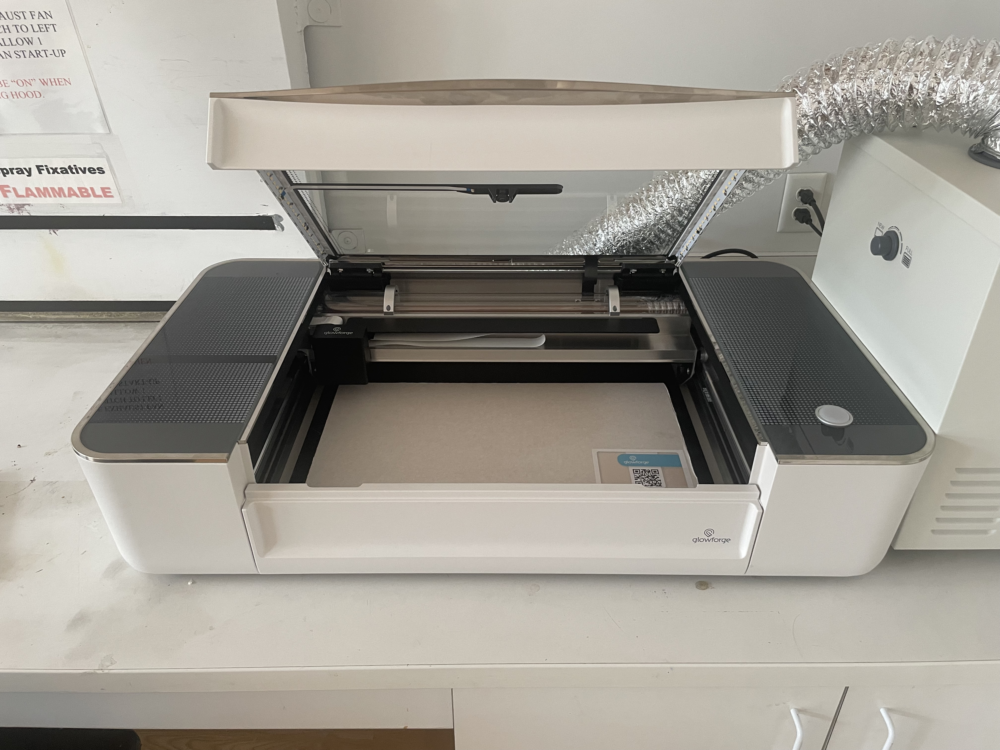
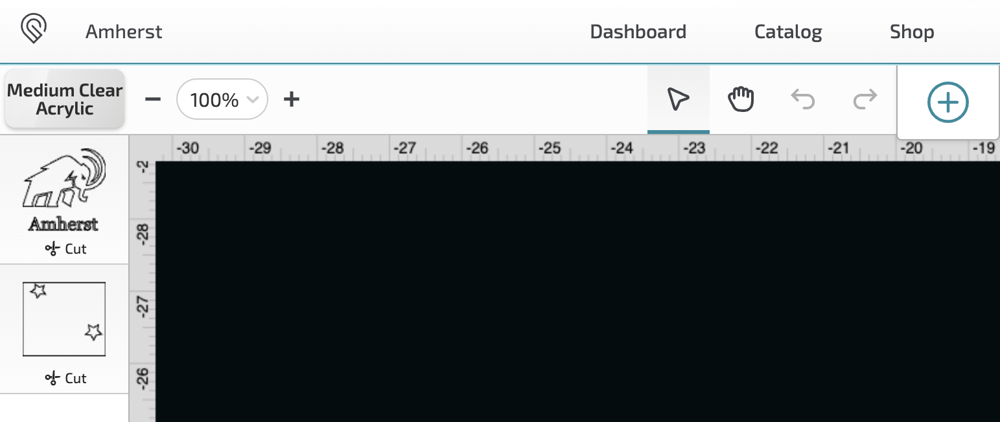
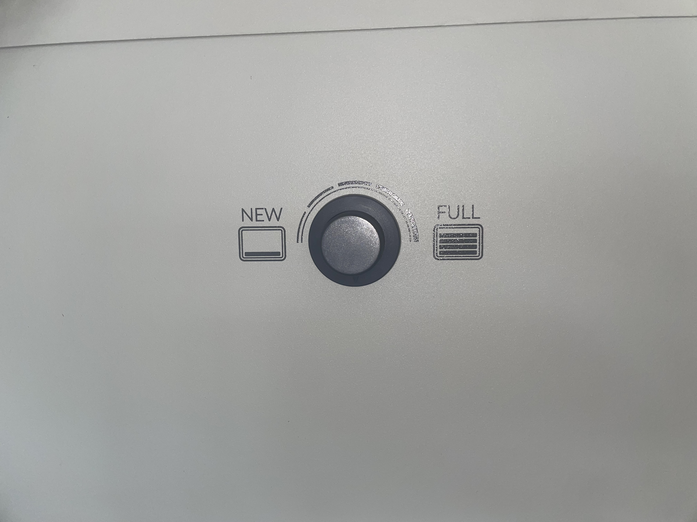
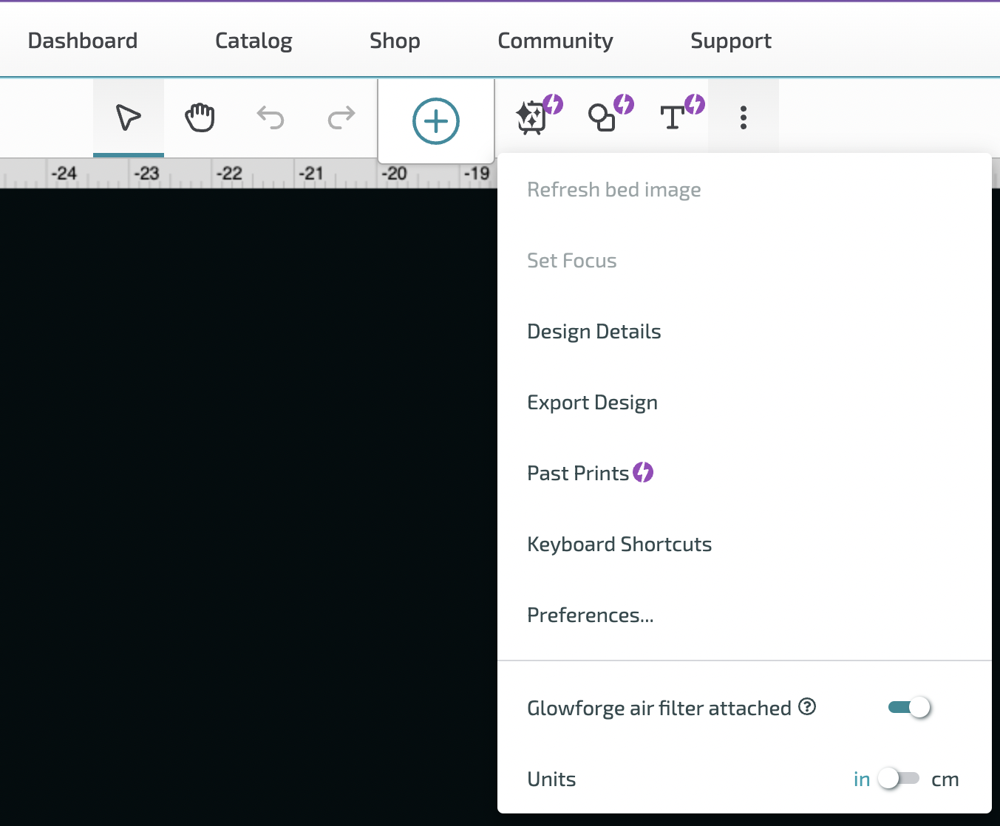

# Glowforge Laser Cutter
 
A laser-cut printer works by focusing light upon a surface and heating it to the point of melting or vaporization. Before you begin laser printing please understand the following:

Be mindful of how long your print will take and how many people need the machine. Cuts take a very short time for any size print. However, scores and engraves especially if their designs are large (>1 in. in total area), intricate, and/or there are many of them, are time-consuming. Projects with these qualities can easily take more than an hour to cut. So try to perform the strictly necessary cuts and save cosmetic additions for when few people are using the machine or there is ample time! You can always put your pieces back in Beamzilla once complete to add details later!

The link to the tutorial can be found [here](https://drive.google.com/file/d/1jFrBDqnlvrWTL0uJDWJCwGLDMnHtsvvK/view?usp=drive_link/).

## To use "Beamzilla" follow the following steps:

- Open app.glowforge.com and sign in/sign up with your Amherst College credentials 

- Turn on Beamzilla with the switch on the back right of the machine. Once it is on double check you are connected to Beamzilla, it should say "Beamzilla" in the top right-hand corner of the Glowforge home screen
- Open Beamzilla's hood gently and place your cutting material on the bottom tray, make sure the QR code is visible, and do not remove the paper on top of the cutting material (If the QR code is not present on the cutting material manually input the material in step 5

- In the Glowforge webpage select Create a New Design (top left corner) then Upload a File select your .svg from your files and open. Depending on the complexity of your print it will process for some time
Check the material listed on the top left is the correct material in Beamzilla, and that your layer objects are correctly listed as cut, engraved, or scored (you can change this by clicking the tabs on the left and changing the operation)
- Change your mind about a specific object being cut/scored/engraved? Select the object, copy it, then hit right-click and select "paste as a new step". It will now appear as a new step on the left tab and you may change its operation. Be sure to delete the original object. 

- Resize and place your objects abiding by the following parameters: Minimizing waste (place objects close and rotated to minimize how much material will be wasted after your print), no objects should overlap (unless specifically desired), Objects have at least a .5 cm gap from the edge of the material
Turn on the air filter using the switch next to the plug. Turn the dial to the appropriate level based on the age of the filter. (Ask the Professor if you are unsure!) Double-check that the air filter and laser cutter are securely connected with the tubing. 

- Make sure the laser cutter is connected to the air filter through the website by clicking the 3 dots to the right of the + button on the website

- Double-check the last few steps and your print is correctly set up on the glowforge page. Hit the print button in the top right of your screen. Be sure to look at the time estimate before you print to ensure you have enough time. Once ready hit the glowing bottom on the bottom right-hand corner on the top of Beamzilla
- Once your print is finished and cooled off gently remove and peel off the protective paper from both sides.

## Important Notes
Do not leave the laser cutter unattended under any circumstances. If you must leave the laser cutter press the glowing button on the top of the machine to pause the print. 
In the event of a fire follow the following instructions:
- Close the door to contain the fire
- Alert people in the area
- Pull the fire alarm, Call ACPD (413-542-2111)
- Extinguish the fire if trained to do so and if evacuate the area 

