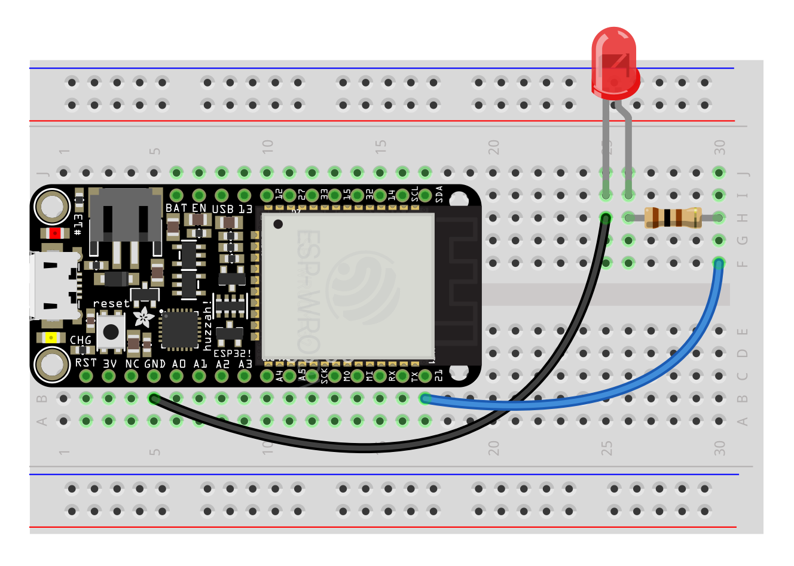

# A Guide to Working with the ESP32

- [Setup](#setup)
- [Inputs](#inputs)
- [Outputs](#outputs)


## <a name="setup"></a> Setup

#### Software and Drivers

To write code for our ESP32s, we will be using Micropython via the Thonny IDE.

##### Driver

First, we have to download and install the [ESP driver](https://www.silabs.com/products/development-tools/software/usb-to-uart-bridge-vcp-drivers) that will allow your machine to communicate with your ESP over a USB port.

When this is finished installing, restart your machine, and then plug in your ESP.

##### Thonny

Next, download and install the [Thonny IDE](https://thonny.org). After opening the program, go to `Tools > Options` and choose `Interpreter`. Choose "MicroPython (ESP32)" for the interpreter, and find the UART Bridge Controller under "Port":

<p align="center">
  
</p>

You will need to have your ESP plugged in for this to work. After you've closed the dialog box, click the "Stop/Restart" stop sign button. In the console, you should see something like:
```
MicroPython v1.18 on 2022-01-17; ESP32 module with ESP32
Type "help()" for more information.
>>>
```

In addition, we need to install the `urequests` and `ujson` packages. Go to `Tools > Manage Packages`. Search for `urequests` and install the first option. Do this with `ujson` as well (note that `ujson` will not show up in the left column as an installed package).

Finally, go to [esp_helper.py](esp/esp_helper.py) and copy the contents. Open Thonny and make a new file, and paste the contents into this file. Then choose `File > Save`, and select `MicroPython device`. Title the file `esp_helper.py` and save it. Once you've done this, close the file.

##### AIO

The Adafruit IO platform provides us with a server:

- Sign up at https://io.adafruit.com
- Create a new "feed" called "hall-sensor" and one called "battery"
- Note your AIO username and AIO key under "My Key"

Back in Thonny, in a new file (or the untitled file showing on the interface), paste your credentials, as well as the wifi info:
```py
SSID = "LC Wireless"
PASS = ""
AIO_USERNAME = "h0use"
AIO_KEY = "XXXXXXXXXXXXXXXXXXXXXXXXXXXXXXXX"
```
Save this file as `credentials.py` to `MicroPython device` (your ESP).

##### Testing

Create a new file containing the following, and save it on your ESP:

```py
from esp_helper import *

while True:
    # connect_wifi()
    hall = esp32.hall_sensor()
    print(hall)
    # post_data("hall-sensor", hall)
```

The hall sensor is a built-in sensor on the ESP which detects magnetic fields. This code will read data from the sensor and print it to console. Run it by clicking the green triangle. You should see a stream of numbers in the console ("Shell"). If you choose `View > Plotter`, you should see a constantly changing graph:

<p align="center">
  
</p>

Now, by uncommenting the lines `connect_wifi()` and `post_data("hall-sensor", hall)`, you will be posting this data to your AIO feed. Do this, and save the file (you will have to click the stop sign before Thonny will be able to copy over the changed file).

Your sensor will now be running much slower (in part to avoid AIO's rate limits):

<p align="center">
  
</p>

Congratulations! You've made a remote sensor. Go back to your feed on AIO, and you should see new data coming in.

Note that this code is running on the ESP, not your computer—if you hook it up to a battery and disconnect it from your computer, it will still work.


## <a name="inputs"></a> Inputs

The input sensors at your disposal are the following:

- [Light level (photocell)](#photo)
- [Contact (FSR)](#fsr)
- [Temperature and humidity](#temp)
- [Range](#range)
- [Sound level](#sound)
- [Touch](#touch)
- [Heartrate](#heart)
- [Toggle switch](#toggle)
- [Momentary switch](#momentary)
- [Tilt + Vibration](#tilt)
- [Knob aka Potentiometer (pot)](#pot)
- [Acceleration and orientation](#imu)


The microcontroller provides a voltage to the sensor, takes a reading, and then transmits the result over the network if desired.

To provide voltage to the sensor, you'll need to connect the sensor to the 3.3v pin on the microcontroller, and also to ground (electricity always flows in a "circuit"—out from the source and then back to the ground).

To take a reading, you'll use the A2, A3, A4, 32 (`D32` in code), 33 (`D33` in code), 12 (`T12`), 13 (`T13`), 14 (`T14`), or SCL and SDA pins on the microcontroller depending on the type of sensor (the others have various other functionality attached to them and may not work initially as expected) along with a resistor or some other component that helps regulate and scale the sensor's output to something the chip can read.

In order to simply the process of hooking things up, we'll use breadboards.

Sensors can break, but overall the ESP is pretty resilient. Two rules:
- **Do not connect 3.3v to another pin or to ground without anything in between**
- **Connect the ground between the ESP and a sensor first, and disconnect it last**

The basic code template is this:

```py
from esp_helper import *    # import esp functions

while True:                 # infinite loop
    connect_wifi()          # connect to wifi
    check_battery()         # check the battery level and log it

    # read a sensor and divide by the maximum value
    # result is a float between 0 and 1
    value = A2.read() / 4095.0  
    sleep(.1)  # include a short delay for stability
    print(value)

    # send to AIO
    post_data("my-sensor", value)
```
The specifics of how the sensor is read may vary slightly between sensors, and are indicated below.


#### <a name="photo"></a> Light (photocell)

A photocell measures the light level. Hook it up with 2k resistor and use A2, A3, A4. If the values you get with 2k are too high, reduce the resistor value until the numbers fall within a range that works for your application.

Product: https://www.adafruit.com/product/161


###### Code
```py
while True:
    # ...
    value = A2.read() / 4095.0  
    sleep(.1)
    # ...
```

#### <a name="fsr"></a> Contact (FSR)

Force-sensitive resistors measure contact. Requires a 10k Ohm resistor and use A2, A3, A4.

Product: https://www.adafruit.com/product/166


###### Code
```py
while True:
    # ...
    value = A2.read() / 4095.0  
    sleep(.1)
    # ...
```

#### <a name="temp"></a> Temperature and Humidity

Temperature and humidity with one sensor via a digital input. Use a 10k Ohm resistor and connect to pin 32 or 33.

Product: https://www.adafruit.com/product/386


###### Code
```py
while True:
    # ...
    sensor = DHT11(D32)
    sensor.measure()
    temp = sensor.temperature() * 1.8 + 32  # convert to F
    humidity = sensor.humidity()
    print(f"{temp}°F")
    print(f"{humidity}%")
    sleep(2)
    # ...
```


#### <a name="range"></a> Range

Ultrasonic range finder! Detects if something is in front of it, from 6 inches to about 20 feet, at a resolution of about an inch. Use A2, A3, A4.

Product: https://www.adafruit.com/product/172


###### Code

```py
# ...

smoother = Smoother(3)   # create a smoother (running averager)
triggered = False
# ...
while True:
    # ...

    # convert sensor reading to feet
    value = (((A2.read() / 4095.0) * 248) + 12) / 12.0
    # smooth out subsequent values
    value = smoother.smooth(value)
    print(value)    
    sleep(.1)

    # trigger something if detects presence closer than 3 ft
    if value < 3:
        if triggered is False:
            print("Closer than 3 ft!")
            triggered = True
    else:
        triggered = False

    # ...        
```
A more complete example is shown for this sensor which uses a smoother and a threshold. Smoothing simply takes subsequent values and averages them—a `Smoother(factor)` must be created outside of the main loop with a number that indicates over how many values to average. We can then use `smoother.smooth(value)` to smooth the readings as we go.

Some additional math is used to convert the sensor reading to feet. This makes it simple to make something like a threshold that detects if something is present within a given distance.

#### <a name="sound"></a> Sound level

You can monitor sound level with the MAX9814. You might keep track of the ambient sound level over time, or look for spikes in the level that cross a particular threshold. Use A2, A3, A4.

Product: https://www.adafruit.com/product/1713


###### Code

Up top:
```py
# ...
window = 50 / 1000.0 # sample for 50ms if testing for a threshold
window = 1.0    # sample for 1 second if monitoring ambient level
# ...

while True:
    # ...    
    start_time = time()
    high = 0
    low = 4096

    while time() - start_time < window:
        sample = A2.read()
        if sample > high:
            high = sample
        elif sample < low:
            low = sample

    level = 100 * ((high - low) / 4095.0)
    print(level)
    # ...
```

#### <a name="touch"></a> Touch

The ESP32 has the built-in ability to measure the "capacitance" on several of its pins. Hooking a wire from one of these to a conductive surface can therefore serve as a "touch" sensor that responds to skin contact.

`esp_helper` has pins 12, 14, and 15 set up as capacitance.


###### Code
```py
while True:
    # ...
    value = touch(T14)
    print(value)
    sleep(.1)

    # threshold-based trigger
    if value > 100:
        print("Touch is happening!")
```


#### <a name="heart"></a> Heart rate


Product: https://www.adafruit.com/product/1093

This sensor works best when the back is covered by something opaque like a piece of electrical tape, and try putting it on your earlobe—read the online guides at [PulseSensor.com](http://PulseSensor.com). Warning: can be very finicky!

Code below based on [this tutorial](https://www.mfitzp.com/invent/wemos-heart-rate-sensor-display-micropython/).


<!-- take out windowing in the future -->

###### Code

```py
from esp_helper import *

MAX_HISTORY = 250
TOTAL_BEATS = 30
WINDOW = 30    # sample heartrate for how many seconds?

history = []
beats = []
beat = False
bpm = 0

while True:
    connect_wifi()

    start_time = time()
    while time() - start_time < WINDOW:

        # get a value from the sensor
        value = A3.read()
        print(value, bpm)

        # keep a list of previous values and dynamically calculate a threshold
        history.append(value)
        history = history[-MAX_HISTORY:]
        minima, maxima = min(history), max(history)
        threshold_on = (minima + maxima * 3) // 4   # 3/4
        threshold_off = (minima + maxima) // 2      # 1/2

        # detect threshold crossing
        if value > threshold_on and beat is False:
            beat = True
            # use the average time between beats to calculate bpm        
            beats.append(time())
            beats = beats[-TOTAL_BEATS:]
            if len(beats):
                beat_time = beats[-1] - beats[0]
                if beat_time:
                    bpm = (len(beats) / (beat_time)) * 60        
            LED.on() # turn on the built-in LED (or trigger something else)

        if value < threshold_off and beat is True:
            beat = False
            LED.off() # turn off the built-in LED

        sleep(.05)

    # after sampling for WINDOW time, report data here
    post_data("heartrate", bpm)

```

#### <a name="toggle"></a> Toggle switch

A simple switch that turns on and off and stays put. Use a 10k resistor. Keep track of the switch's status with a variable so that you can trigger things based on a change.

Product: https://www.adafruit.com/product/805


###### Code
```py
#...
toggled = False
#...

while True:
    #...
    status = A2.read() > 0 # True or False
    if status != toggled:
        if status is True:
            print("Switch turned on!")
        else:
            print("Switch turned off!")
        toggled = status
    sleep(.1)
    #...

```

#### <a name="momentary"></a> Momentary switch

A simple switch that is on when pushed and off otherwise. Use a 10k resistor. Keep track of the switch's status with a variable so that you can trigger things based on a change.

Product: https://www.adafruit.com/product/1119


###### Code
```py
#...
pressed = False
#...

while True:
    #...
    status = A2.read() > 0 # True or False
    if pressed != status:
        if status is True:
            print("Switch turned on!")
        else:
            print("Switch turned off!")
        pressed = status
    sleep(.01)  # make it a bit faster for an interface where timing counts
    #...
```

#### <a name="tilt"></a> Tilt + Vibration

These components are simple switches that turn on and off based on an internal spring or bearing changing position—they are useful for detecting movement in the sensor itself. Note that one of the legs is very fine and can be tricky with breadboards (especially with vibration sensors). Use a 10k resistor. Keep track of the switch's status with a variable so that you can trigger things based on a change.

Products:
- https://www.adafruit.com/product/1119
- https://www.adafruit.com/product/1766


###### Code
```py
#...
tilted = False
#...

while True:
    #...
    status = A2.read() > 0 # True or False
    if tilted != status:
        print("Movement!")
        tilted = status
    sleep(.01)  # make it a bit faster for an interface where timing counts
    #...

```

#### <a name="pot"></a> Knob aka Potentiometer (pot)

This is a variable resistor—which means that as you turn the pot, more or less voltage is let through to the measuring pin. Pots in a 3.3v system can be jittery, so use a smoother to smooth some of that out.

Product: https://www.adafruit.com/product/562


###### Code
```py
#...
smoother = Smoother(3)
#...
while True:
    #...
    pot = A2.read()
    pot = smoother.smooth(pot)
    print(pot)
    sleep(.01) # shorter delay
    #...
```

#### <a name="imu"></a> Acceleration and Orientation

An The MPU-6050 is an IMU (Inertial Measurement Unit) that includes an accelerometer and an gyroscope. Hook it up to the SCL and SDA pins (you will not need to specify the pins in your code, library does it automatically).

Product: https://www.amazon.com/s?k=mpu-6050&ref=nb_sb_noss

This is a more complex sensor that returns six measurements (aka 6-DoF, or Degrees of Freedom). It may or may not be useful without "sensor fusion."

###### Code

This code requires that you add the file [mpu6050.py](esp/mpu6050.py) to your ESP32.


```py
import mpu6050

mpu = mpu6050.MPU()

while True:
    v = mpu.read()
    print(v)
    sleep(1/60.0) # about the speed of a gesture
```


## <a name="outputs"></a> Outputs

The outputs at your disposal are the following:

- [LEDs](#led)
- [Piezos](#piezo)
<!-- - [Neopixels](#neopixel) -->
<!-- - [Relay](#relay) -->
<!-- - [Motor](#motor) -->

For outputs, the microcontroller turns voltage on or off across a specific pin, producing some effect in a component such as an LED or relay.

For our purposes, use pins 21 and 27 on your ESP32 (`S21` and `S27` in your code).


#### <a name="led"></a> LEDs

Light-emitting diodes! Connect the long leg (+) of these all purpose lofi lights to a resistor and an output pin (21 or 27) and the short leg (-) to ground.

- The forward voltage of an LED is how much it takes out of the circuit to turn on.
- The current of an LED is how bright it's going to be.
- ...but LEDs don't have any inherent resistance, so an added resistor is always needed to limit the current to prevent a short (aka, no infinite brightness).

For the 3.3v ESP32 and the resistors we have on hand, use an 100ohm resistor (or the smallest you can find).

<!-- To calculate the value of resistor given a 3.3v (ESP32) or 5v (Arduino) supply_voltage:
`R = (supply_voltage - forward_voltage) / current` (or use a [resistor calculator](https://www.digikey.in/en/resources/conversion-calculators/conversion-calculator-led-series-resistor))

Product: https://www.adafruit.com/product/4203

Red, Yellow, Green (~2v forward voltage at 20mA):
- Resistor @ 3.3v: 65 ohms
- Resistor @ 5v: 150 ohms


Blue, White (~3v forward voltage at 20mA):
- Resistor @ 3.3v: 15 ohms
- Resistor @ 5v: 100 ohms -->




###### Code

This example modifies the switch example to turn on and off an LED depending on whether the button is pressed:
```py
#...
pressed = False
#...

while True:
    #...
    status = A2.read() > 0 # True or False
    if pressed != status:
        if status is True:
            print("Switch turned on!")
            S21.on() # turn on output pin / LED
        else:
            print("Switch turned off!")
            S21.off() # turn off output pin / LED
        pressed = status
    sleep(.01)  # make it a bit faster for an interface where timing counts
    #...
```


#### <a name="piezo"></a> Piezo

```py
from esp_helper import *

# a bug means min frequency is 700hz -- need to wait for firmware > 1.18
pwm = PWM(S21)
pwm.duty(512)
pwm.freq(700)
print(pwm)
```


<!--
Streaming:
```py
from esp_helper import *


while True:
    connect_wifi()

    try:
        hall = esp32.hall_sensor() / 4095.0
        stream_data(hall, "192.168.8.211")
        print(hall)
    except OSError as e:
        print("Error: " + str(e))

    sleep(.01)
``` -->
