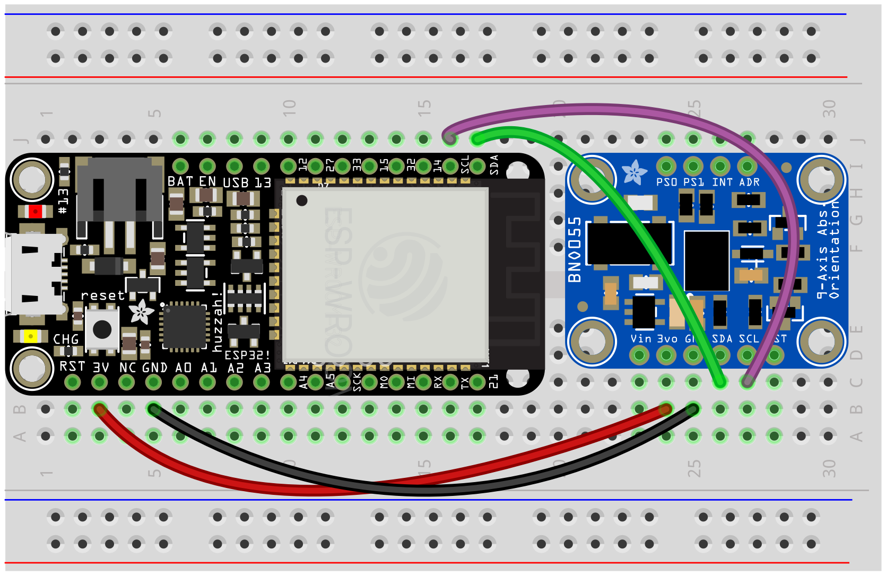

# IMUs

An IMU is an "Inertial Measurement Unit"—it's actually three sensors in one, a gyroscope, an accelerometer, and a compass. Put together, and with the addition of lots of math (that it does for us), an IMU can tell us how it is oriented in space. 

This comes in the form `heading` (which direction it's pointing relative to the surface of the earth), `pitch` (how much it's angled up or down) and `roll` (how much it's angled side to side). Each of these is a degree value, 0-360.


Accelerometer Calibration

Place the device in 6 different stable positions for a period of few seconds to allow the accelerometer to calibrate.

Make sure that there is slow movement between 2 stable positions.

The 6 stable positions could be in any direction, but make sure that the device is lying at least once perpendicular to the x, y and z axis.

The cal_status() method may be used to see the calibration status of the accelerometer.

rotate 45 degrees

Gyroscope Calibration

Place the device in a single stable position for a period of few seconds to allow the gyroscope to calibrate
The cal_status() method may be used to see the calibration status of the gyroscope.
Magnetometer Calibration

Magnetometers in general are susceptible to both hard-iron and soft-iron distortions, but the majority of the cases are rather due to the former. The steps mentioned below are to calibrate the magnetometer for hard-iron distortions.

Make some random movements (for example: writing the number ‘8’ on air) until the cal_status() method indicates fully calibrated.
It takes more calibration movements to get the magnetometer calibrated than in the NDOF mode.



###### Code

```py
from esp_helper import *

while True:

    if imu_calibrated():
        LED.off()
        heading, pitch, roll = get_orientation()
        acceleration = get_accel()
        print(int(pitch), int(roll))
    else:
        LED.on()   # indicate whether we still need to calibrate
    sleep(.1)
```    

