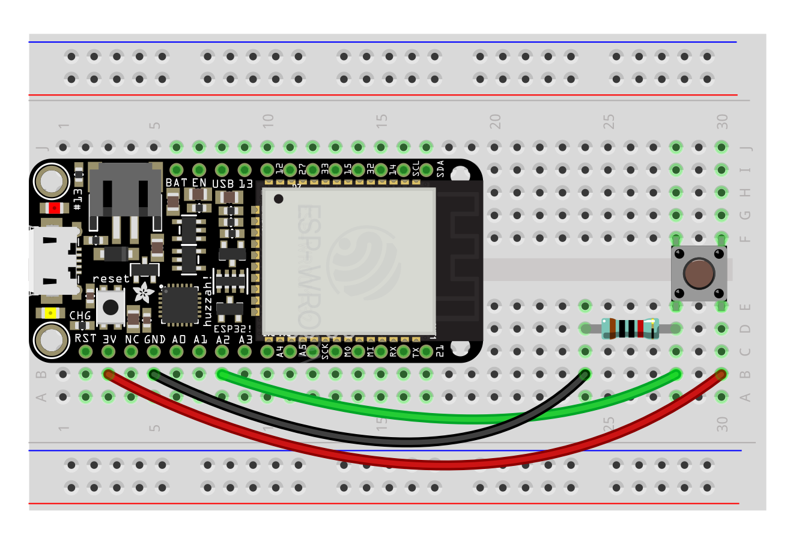
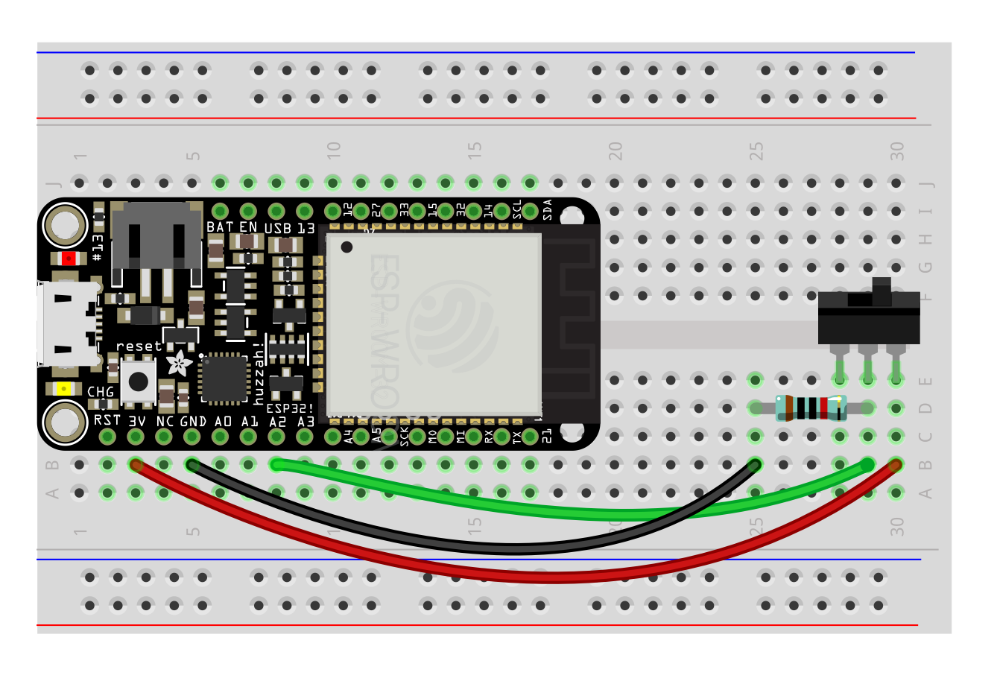
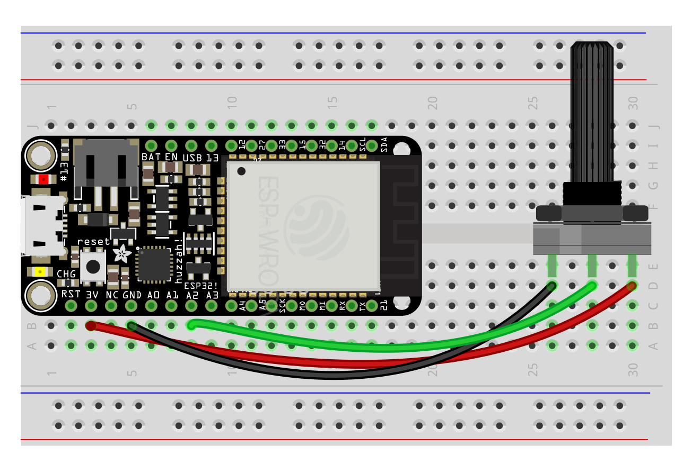

# Sensors

- [Button](#button)
- [Toggle](#toggle)
- [Knob](#knob)


## <a name="button"></a> Buttons

Otherwise knon as a "momentary switch," buttons are on when pushed and off otherwise. Use a 10k resistor. Keep track of the buttons's status with a variable so that you can trigger things based on a change.



###### Code
```py
#...
pressed = False
#...

while True:
    #...
    status = A2.read() > 0 # True or False
    if pressed != status:
        if status is True:
            print("Switch turned on!")
        else:
            print("Switch turned off!")
        pressed = status
    sleep(.01)  # make it a bit faster for an interface where timing counts
    #...
```

#### <a name="toggle"></a> Toggle switch

A simple switch that turns on and off and stays put. Use a 10k resistor. Keep track of the switch's status with a variable so that you can trigger things based on a change.

Product: https://www.adafruit.com/product/805



###### Code
```py
#...
toggled = False
#...

while True:
    #...
    status = A2.read() > 0 # True or False
    if status != toggled:
        if status is True:
            print("Switch turned on!")
        else:
            print("Switch turned off!")
        toggled = status
    sleep(.1)
    #...

```


## <a name="pot"></a> Knob aka Potentiometer (pot)

This is a variable resistor—which means that as you turn the pot, more or less voltage is let through to the measuring pin. Pots in a 3.3v system can be jittery, so use a smoother to smooth some of that out.



###### Code
```py
#...
smoother = Smoother(3)
#...
while True:
    #...
    pot = A2.read()
    pot = smoother.smooth(pot)
    print(pot)
    sleep(.01) # shorter delay
    #...
```


