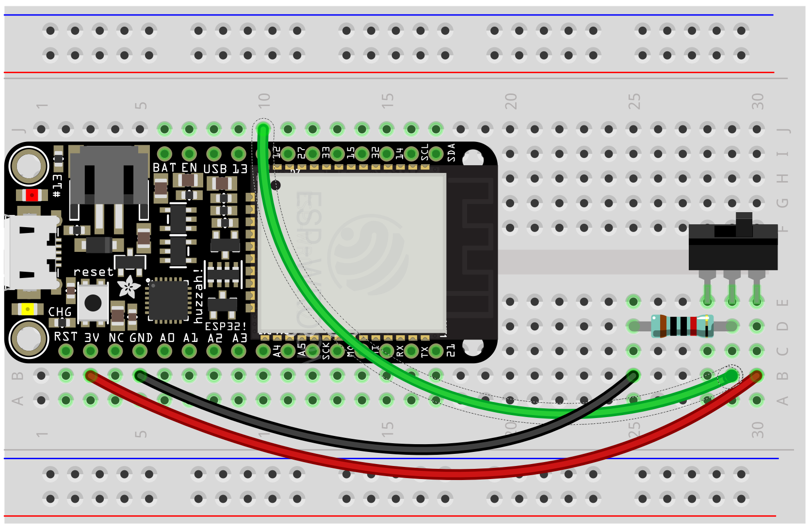
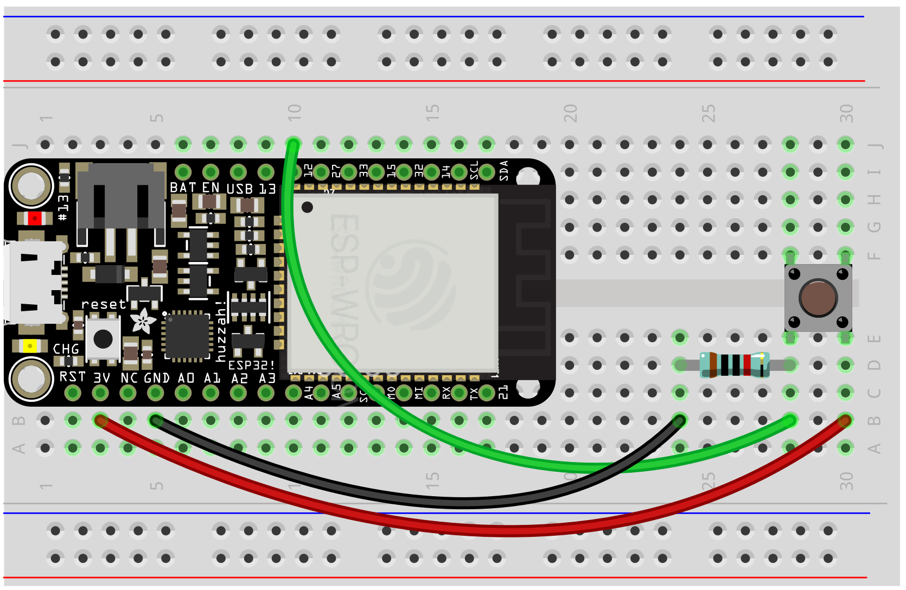
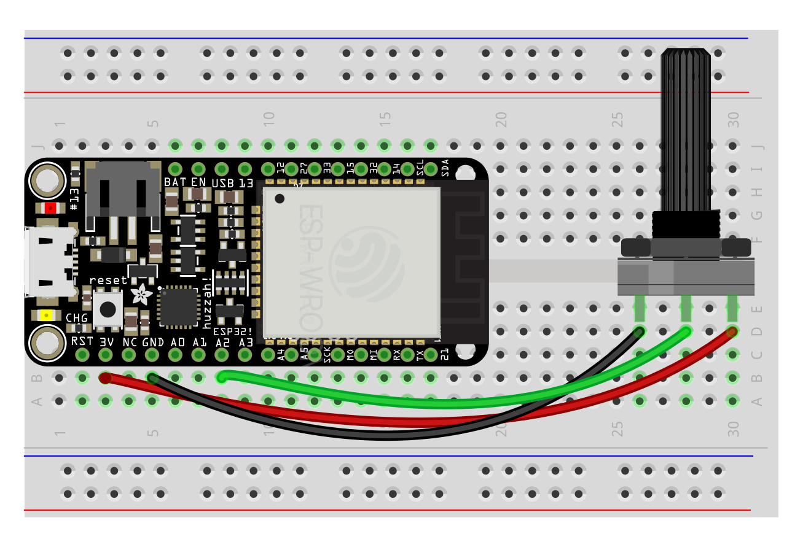

# Interface

By adding buttons, toggles, and knobs to microcontrollers, we can control aspects of the program while it's running, creating interfaces for an instrument. In essence, these are no different than sensors. 

We'll work with the following components:

- [Toggle](#toggle)
- [Button](#button)
- [Knob](#pot)

We're limited to 4 knobs, which are used with analog inputs, and 7 buttons or toggles, which can use the GPIOS.

Remember: **Do not connect 3.3v to another pin or to ground without anything in between**


#### <a name="toggle"></a> Toggle switch

A simple switch that turns on and off and stays put. Use a 10k resistor. Keep track of the switch's status with a variable so that you can trigger things based on a change.

Product: https://www.adafruit.com/product/805



###### Code
```py
from esp_helper import *

toggle = IN(12)  # toggle on pin 12

while True:
    if toggle.value() > 0:
        print("Toggle is on!")
    else:
        print("Toggle is off!")
    sleep(.1)
```


## <a name="button"></a> Button

Otherwise known as a "momentary switch," buttons are on when pushed and off otherwise. Use a 10k resistor and a GPIO Pin (13, 12, 27, 33, 15, 32, 14). Keep track of a button's status with a variable so that you can trigger things based on a change.



###### Code
```py
from esp_helper import *

button = IN(12)  # button on pin 12

previous_status = False
while True:
    status = button.value() > 0         # get current status, True or False
    if status != previous_status:       # detect a change
        if status is True:
            print("Switch turned on!")
        else:
            print("Switch turned off!")
        previous_status = status        # store the status for next time
    sleep(.01)  # make it a bit faster for an interface where timing counts
```


## <a name="pot"></a> Knob (aka potentiometer aka pot)

This is a variable resistor—which means that as you turn the pot, more or less voltage is let through to the measuring pin. Use an analog pin (A2, A3, A4). Pots in a 3.3v system can be jittery, so use a smoother to smooth some of that out.



###### Code
```py
from esp_helper import *

smoother = Smoother(3)

while True:
    #...
    pot = A2.read()
    pot = smoother.smooth(pot)
    print(pot)
    sleep(.01) # shorter delay
```

Multiple knobs:
```py
from esp_helper import *

smoother_a = Smoother(3)
smoother_b = Smoother(3)

while True:
    pot_a = A2.read()
    pot_a = smoother_a.smooth(pot_a)

    pot_b = A3.read()
    pot_b = smoother_b.smooth(pot_b)

    print('A', pot_a, 'B', pot_b)

    sleep(.01)
```

<!-- WORKSHOP

Use LEDs for buttons
Use Neopixels or Piezo for knobs

-->
