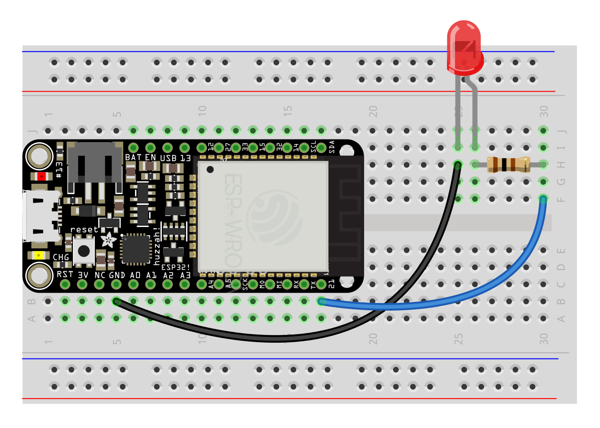

from esp_helper import *

led = OUT(21)

while True:
    led.on()
    sleep(1)
    led.off()
    sleep(1)
# LEDs

Light-emitting diodes! Connect the long leg (+) of these all-purpose lofi lights to a resistor and a GPIO pin (13, 12, 27, 33, 15, 32, 14, 21) and the short leg (-) to ground.

- The forward voltage of an LED is how much it takes out of the circuit to turn on.
- The current of an LED is how bright it's going to be.
- ...but LEDs don't have any inherent resistance, so an added resistor is always needed to limit the current to prevent a short (aka, no infinite brightness).

For the 3.3v ESP32 and the resistors we have on hand, use a 100ohm resistor (or the smallest you can find).

<!-- To calculate the value of resistor given a 3.3v (ESP32) or 5v (Arduino) supply_voltage:
`R = (supply_voltage - forward_voltage) / current` (or use a [resistor calculator](https://www.digikey.in/en/resources/conversion-calculators/conversion-calculator-led-series-resistor))

Product: https://www.adafruit.com/product/4203

Red, Yellow, Green (~2v forward voltage at 20mA):
- Resistor @ 3.3v: 65 ohms
- Resistor @ 5v: 150 ohms


Blue, White (~3v forward voltage at 20mA):
- Resistor @ 3.3v: 15 ohms
- Resistor @ 5v: 100 ohms -->




###### Code

Alternating on two LEDs:
```py
from esp_helper import *

led = OUT(21)

while True:
    led.on()
    sleep(1)
    led.off()
    sleep(1)
```
