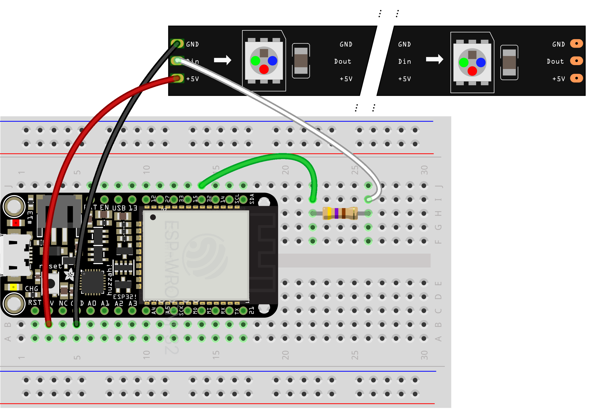

# Neopixels

NeoPixels are colored lights that we can control with the ESP32s. Unlike regular LEDs, which are simply on and off, NeoPixels can be any color and brightness. They can be single lights, but they also come in strands, all of the lights of which can be controlled via a single pin on a microcontroller.

In the code, NeoPixels are represented as a [list](micropython.md#lists). Each item in the list corresponds to a pixel, and it's set to a color. In code, colors are often represented by a tuple of three values, one each for red, green, and blue. Conventionally, these values range from 0 to 255, and by mixing them together, all colors are possible. So, for example, red is `255, 0, 0`, green is `0, 255, 0`, and blue is `0, 0, 255`. Cyan would be `0, 255, 255`, and a deep purple is `158, 22, 113`. 


## Strips

NeoPixel strips have three wires to connect: power, ground, and control. Connect power to 3.3v, ground to ground, and control to the GPIO pin of your choice via 470 ohm resistor.





##### Code

```py
from esp_helper import *

pixels = NEOPIXELS(32, 20, 3)   # create NeoPixel driver on pin 32 for 20 RGB pixels
                                # get a list of pixels in return

while True:
    for i in range(20):         # there are 20 pixels in our strip        
        pixels[i] = randint(0, 255), randint(0, 255), randint(0, 255)   # pick a random color
    pixels.write()              # write data to all pixels
    sleep(.5)                   # wait a half second
```

## Individual pixels

A single NeoPixel has four legs, shown here:


Connect power and ground with a 0.1 µF capacitor between them. Then connect the "Data In" pin to a GPIO pin on the microcontroller.


Note that you can chain several individual NeoPixels together by connecting the "Data Out" pin of one to the "Data In" pin of the next. This way, they all share the same GPIO pin, just like a NeoPixel strip. They all need a separate capacitor, however, and they'll need to be wired to power and ground individually.


<!-- ## Long strips

Separate power supply, 5V DC

Adding a 300 to 500 Ohm resistor between your microcontroller's data pin and the data input on the first NeoPixel can help prevent voltage spikes that might otherwise damage your first pixel. Please add one between your micro and NeoPixels!


On larger projects, you may need to add a capacitor (100 to 1000 µF, 6.3V or higher) across the + and – terminals for more reliable operation. See the photo on the next page for an example.

If powering the pixels with a separate supply, apply power to the pixels before applying power to the microcontroller. Otherwise, they’ll try to power “parasitically” through the data line, which could spell trouble for the microcontroller.

If your microcontroller and NeoPixels are powered from two different sources (e.g. separate batteries for each), there must be a ground connection between the two.

https://learn.adafruit.com/adafruit-neopixel-uberguide/powering-neopixels 


## general

The idea is to match the power and control voltages

https://learn.adafruit.com/adafruit-neopixel-uberguide/basic-connections


-->