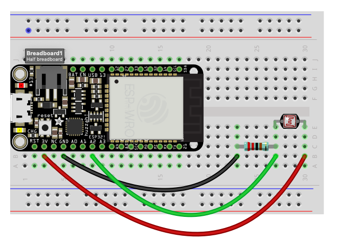
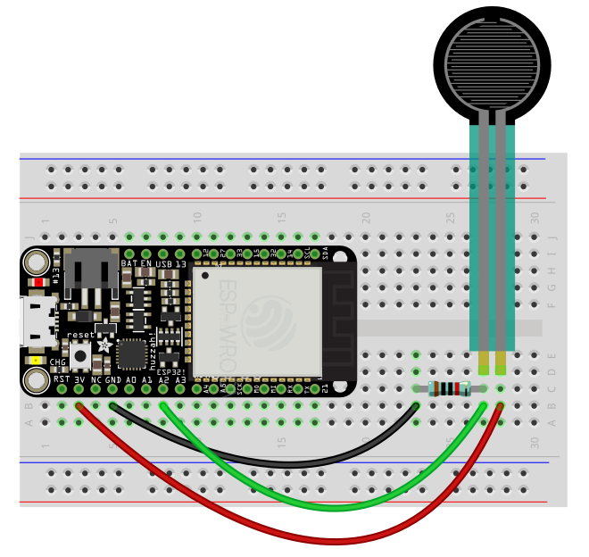
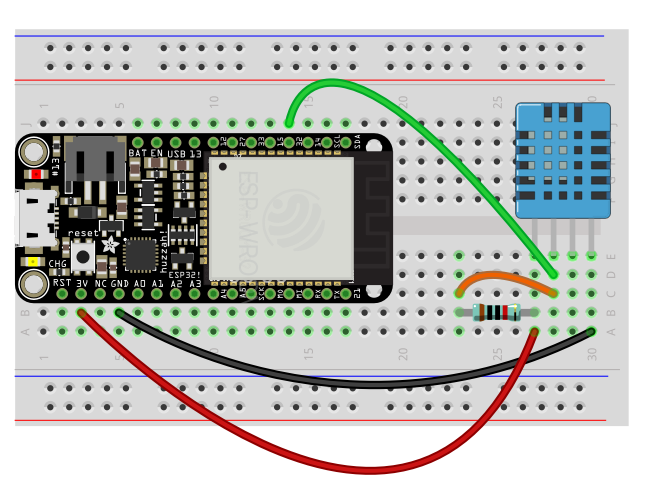
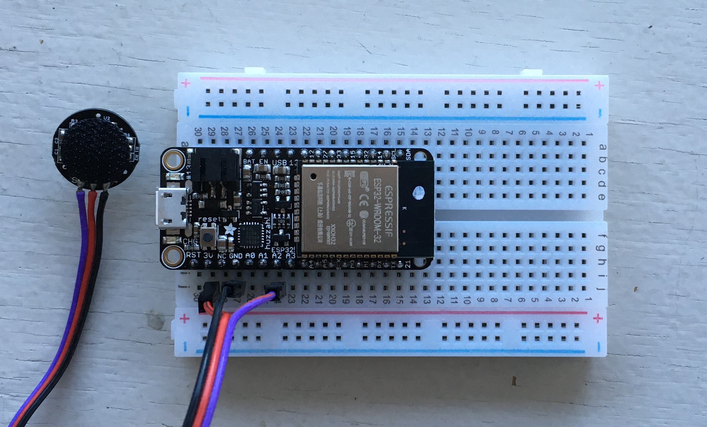
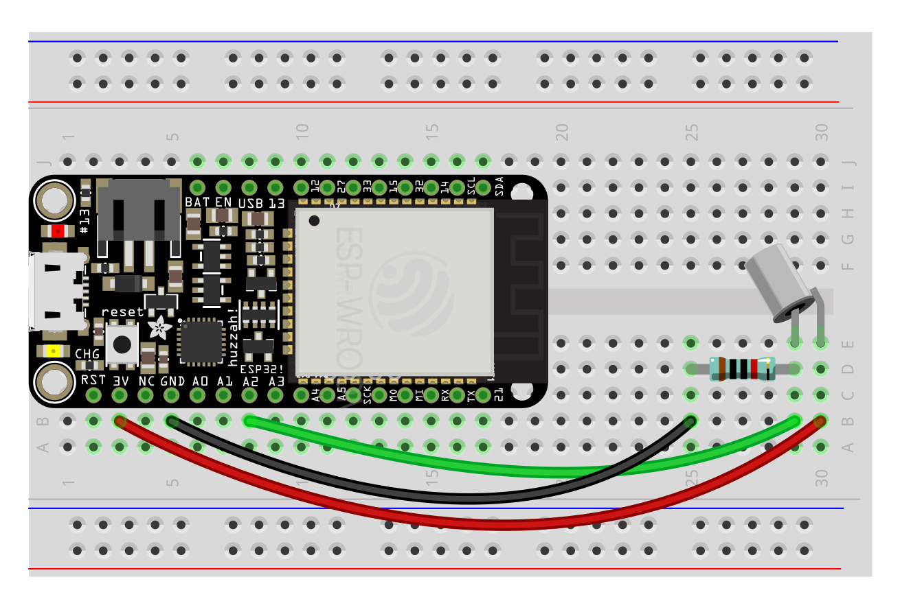

## <a name="inputs"></a> Inputs

The input sensors at your disposal are the following:

- [Light level (photocell)](#photo)
- [Contact (FSR)](#fsr)
- [Temperature and humidity](#temp)
- [Range](#range)
- [Sound level](#sound)
- [Touch](#touch)
- [Heartrate](#heart)
- [Toggle switch](#toggle)
- [Momentary switch](#momentary)
- [Tilt + Vibration](#tilt)
- [Knob aka Potentiometer (pot)](#pot)
- [Acceleration and orientation](#imu)


The microcontroller provides a voltage to the sensor, takes a reading, and then transmits the result over the network if desired.

To provide voltage to the sensor, you'll need to connect the sensor to the 3.3v pin on the microcontroller, and also to ground (electricity always flows in a "circuit"—out from the source and then back to the ground).

To take a reading, you'll use the A2, A3, A4, 32 (`D32` in code), 33 (`D33` in code), 12 (`T12`), 13 (`T13`), 14 (`T14`), or SCL and SDA pins on the microcontroller depending on the type of sensor (the others have various other functionality attached to them and may not work initially as expected) along with a resistor or some other component that helps regulate and scale the sensor's output to something the chip can read.

In order to simply the process of hooking things up, we'll use breadboards.

Sensors can break, but overall the ESP is pretty resilient. Two rules:
- **Do not connect 3.3v to another pin or to ground without anything in between**
- **Connect the ground between the ESP and a sensor first, and disconnect it last**

The basic code template is this:

```py
from esp_helper import *    # import esp functions

while True:                 # infinite loop
    connect_wifi()          # connect to wifi
    check_battery()         # check the battery level and log it

    # read a sensor and divide by the maximum value
    # result is a float between 0 and 1
    value = A2.read() / 4095.0  
    sleep(.1)  # include a short delay for stability
    print(value)

    # send to AIO
    post_data("my-sensor", value)
```
The specifics of how the sensor is read may vary slightly between sensors, and are indicated below.


#### <a name="photo"></a> Light (photocell)

A photocell measures the light level. Hook it up with 2k resistor and use A2, A3, A4. If the values you get with 2k are too high, reduce the resistor value until the numbers fall within a range that works for your application.

Product: https://www.adafruit.com/product/161



###### Code
```py
while True:
    # ...
    value = A2.read() / 4095.0  
    sleep(.1)
    # ...
```

#### <a name="fsr"></a> Contact (FSR)

Force-sensitive resistors measure contact. Requires a 10k Ohm resistor and use A2, A3, A4.

Product: https://www.adafruit.com/product/166



###### Code
```py
while True:
    # ...
    value = A2.read() / 4095.0  
    sleep(.1)
    # ...
```

#### <a name="temp"></a> Temperature and Humidity

Temperature and humidity with one sensor via a digital input. Use a 10k Ohm resistor and connect to pin 32 or 33.

Product: https://www.adafruit.com/product/386



###### Code
```py
while True:
    # ...
    sensor = DHT11(D32)
    sensor.measure()
    temp = sensor.temperature() * 1.8 + 32  # convert to F
    humidity = sensor.humidity()
    print(f"{temp}°F")
    print(f"{humidity}%")
    sleep(2)
    # ...
```


#### <a name="heart"></a> Heart rate


Product: https://www.adafruit.com/product/1093

This sensor works best when the back is covered by something opaque like a piece of electrical tape, and try putting it on your earlobe—read the online guides at [PulseSensor.com](http://PulseSensor.com). Warning: can be very finicky!

Code below based on [this tutorial](https://www.mfitzp.com/invent/wemos-heart-rate-sensor-display-micropython/).



<!-- take out windowing in the future -->

###### Code

```py
from esp_helper import *

MAX_HISTORY = 250
TOTAL_BEATS = 30
WINDOW = 30    # sample heartrate for how many seconds?

history = []
beats = []
beat = False
bpm = 0

while True:
    connect_wifi()

    start_time = time()
    while time() - start_time < WINDOW:

        # get a value from the sensor
        value = A3.read()
        print(value, bpm)

        # keep a list of previous values and dynamically calculate a threshold
        history.append(value)
        history = history[-MAX_HISTORY:]
        minima, maxima = min(history), max(history)
        threshold_on = (minima + maxima * 3) // 4   # 3/4
        threshold_off = (minima + maxima) // 2      # 1/2

        # detect threshold crossing
        if value > threshold_on and beat is False:
            beat = True
            # use the average time between beats to calculate bpm        
            beats.append(time())
            beats = beats[-TOTAL_BEATS:]
            if len(beats):
                beat_time = beats[-1] - beats[0]
                if beat_time:
                    bpm = (len(beats) / (beat_time)) * 60        
            LED.on() # turn on the built-in LED (or trigger something else)

        if value < threshold_off and beat is True:
            beat = False
            LED.off() # turn off the built-in LED

        sleep(.05)

    # after sampling for WINDOW time, report data here
    post_data("heartrate", bpm)

```


#### <a name="tilt"></a> Tilt + Vibration

These components are simple switches that turn on and off based on an internal spring or bearing changing position—they are useful for detecting movement in the sensor itself. Note that one of the legs is very fine and can be tricky with breadboards (especially with vibration sensors). Use a 10k resistor. Keep track of the switch's status with a variable so that you can trigger things based on a change.

Products:
- https://www.adafruit.com/product/1119
- https://www.adafruit.com/product/1766



###### Code
```py
#...
tilted = False
#...

while True:
    #...
    status = A2.read() > 0 # True or False
    if tilted != status:
        print("Movement!")
        tilted = status
    sleep(.01)  # make it a bit faster for an interface where timing counts
    #...

```