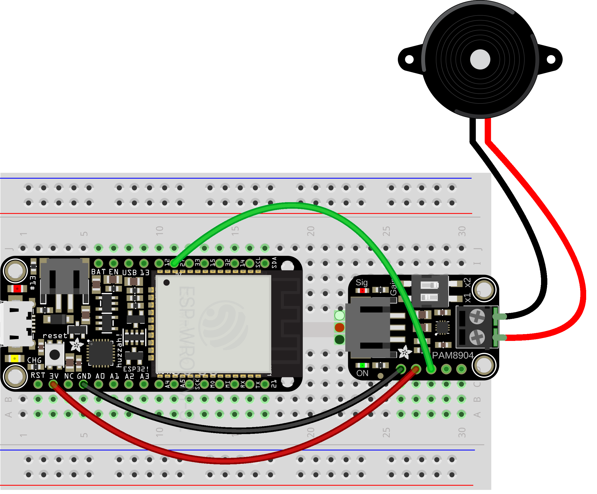

# Piezos

The [piezoelectric effect](https://en.wikipedia.org/wiki/Piezoelectricity) is a property of some materials to respond mechanically to electricity. In this case, a small ceramic disc, when glued to a larger metal one, will bend. Do this fast enough, and at a specific frequency, and you have a very basic speaker—one that can be controlled directly from a microcontroller.


## Piezo amp

While a piezo will work when it's directly connected to a GPIO pin, this will bend it in only one direction. A piezo amplifier doubles the volume by switching polarity on the piezo according to the signal.

To use it, hook ground and power to the amplifier board, and then connect signal to a GPIO pin of your choice (12, 27, 33, 15, 32, 14, 21). 




###### Code

Set up your GPIO pin using `TONE()`

Play a major scale:
```py
from esp_helper import *

C = 262
D = 294
E = 330
F = 349
G = 392
A = 440
B = 494
C2 = 523
R = 500000

tune = C, D, E, F, G, A, B, C2

beeper = TONE(27)

while True:
    for note in range(len(tune)):
        beeper.freq(tune[note])
        sleep(.5)

beeper.freq(R)
beeper.deinit()

```

Random robot:
```py
from esp_helper import *
from random import randint

beeper = TONE(27)

while True:
    beeper.freq(randint(500, 1000))     # random frequency between 500 and 1,000
    sleep(randint(1, 100) / 100.0)   # sleep a random duration between .01 and 1 seconds

beeper.freq(500000)
beeper.deinit()
```

Mapping a sensor value to frequency:
```py
from esp_helper import *

beeper = TONE(27)

while True:
    sensor_value = A2.read()
    frequency = map(sensor_value, 0, 4095, 100, 1000)  # scale 0–4095 to 0–10
    beeper.freq(frequency)
    sleep(.1)

beeper.freq(500000)
beeper.deinit()
```


<!-- WORKSHOP

Make a cool changing sound or melody

-->


### Physical setup

On its own, a piezo is very quiet. Try attaching it to a thin, rigid material, or even building an enclosure, to increase the volume.

Keep in mind that the connections to the ceramic disc are fragile; you may want to use some hot glue to strengthen that connection.

