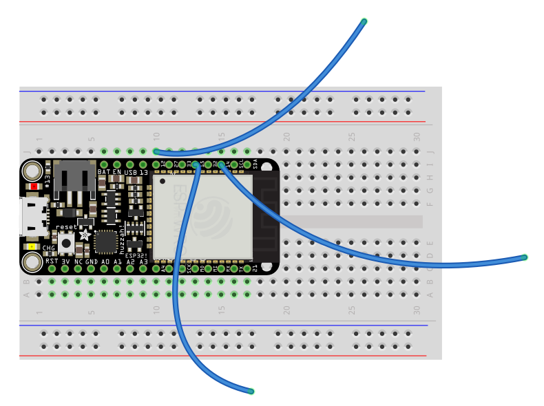
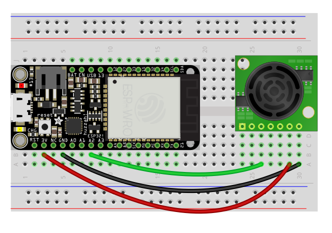
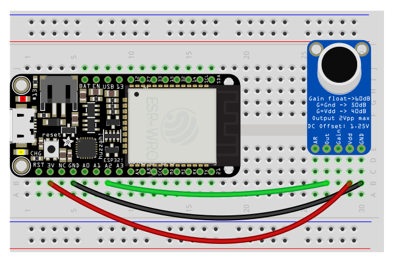

# Sensors

The sensors at your disposal are the following:

- [Presence / distance](#range)
- [Sound level](#sound)
- [Touch](#touch)


The microcontroller provides a voltage to the sensor, takes a reading, and then you can use that value to respond in some way.

To provide voltage to the sensor, you'll need to connect the sensor to the 3.3v pin on the microcontroller, and also to ground (electricity always flows in a "circuit"—out from the source and then back to the ground).

To take a reading, you'll use the A2, A3, A4, 32 (`D32` in code), 33 (`D33` in code), 12 (`T12`), 13 (`T13`), 14 (`T14`), or SCL and SDA pins on the microcontroller depending on the type of sensor. You may need a resistor or some other component that helps regulate and scale the sensor's output to something that the chip can read.

Sensors can break, but overall the ESP is pretty resilient. Two rules:
- **Do not connect 3.3v to another pin or to ground without anything in between**
- **Connect the ground between the ESP and a sensor first, and disconnect it last**


## <a name="touch"></a> Touch

The ESP32 has the built-in ability to measure the "capacitance" on several of its pins. Hooking a wire from one of these to a conductive surface can therefore serve as a "touch" sensor that responds to skin contact.

`esp_helper` has pins 12, 14, and 15 set up as capacitance.



###### Code
```py
while True:
    # ...
    value = touch(T14)
    print(value)
    sleep(.1)

    # threshold-based trigger
    if value > 100:
        print("Touch is happening!")
```


## <a name="range"></a> Range

Ultrasonic range finder! Detects if something is in front of it, from 6 inches to about 20 feet, at a resolution of about an inch. Use A2, A3, or A4.



###### Code

```py
# ...

smoother = Smoother(3)   # create a smoother (averages over N values)
triggered = False
# ...
while True:
    # ...

    # convert sensor reading to feet
    value = (((A2.read() / 4095.0) * 248) + 12) / 12.0

    # smooth out subsequent values
    value = smoother.smooth(value)
    print(value)    

    # sleep for stability
    sleep(.1)

    # "value" can be used directly, or:
    # trigger something if detects presence closer than 3 ft
    if value < 3:
        if triggered is False:
            print("Closer than 3 ft!")
            triggered = True
    else:
        triggered = False

    # ...        
```
This example uses a smoother and a threshold. Smoothing simply takes subsequent values and averages them—a `Smoother(factor)` must be created outside of the main loop with a number that indicates over how many values to average. We can then use `smoother.smooth(value)` to smooth the readings as we go.

Some additional math is used to convert the sensor reading to feet. This makes it simple to make something like a threshold that detects if something is present within a given distance.

## <a name="sound"></a> Sound level

You can monitor sound level with the MAX9814. You might keep track of the ambient sound level over time, or look for spikes in the level that cross a particular threshold. Use A2, A3, A4.



###### Code

```py
# ...
window = 50 / 1000.0 # sample for 50ms if testing for a threshold
window = 1.0    # sample for 1 second if monitoring ambient level
# ...

while True:
    # ...    
    start_time = time()
    high = 0
    low = 4096

    while time() - start_time < window:
        sample = A2.read()
        if sample > high:
            high = sample
        elif sample < low:
            low = sample

    level = 100 * ((high - low) / 4095.0)
    print(level)
    # ...
```

