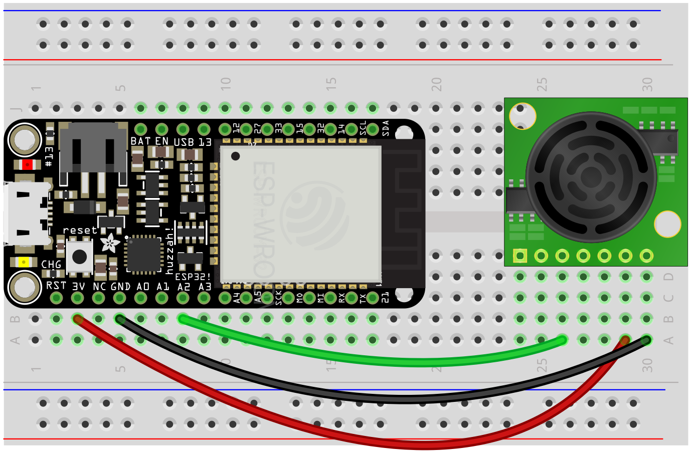
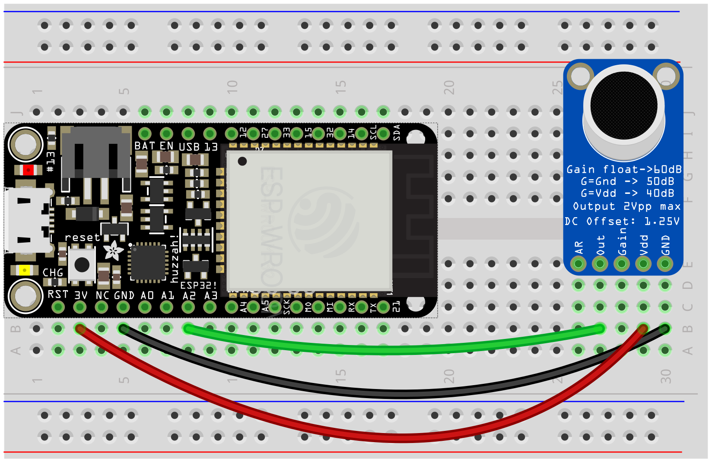
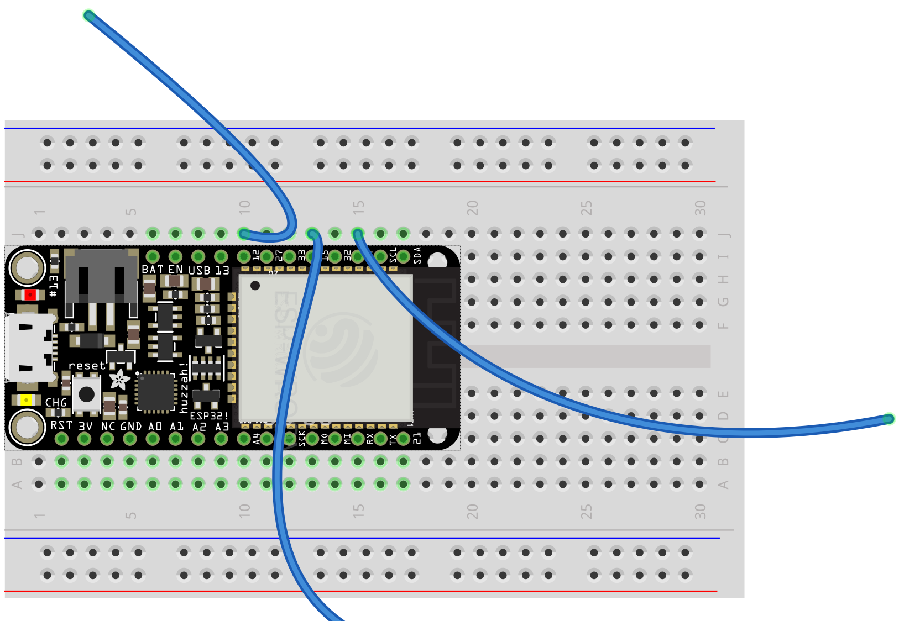

# Sensors

In general, analog sensors work by the microcontroller providing a voltage to the sensor, taking a reading, and then responding to that value in some way.

To provide voltage to the sensor, you'll need to connect the sensor to the 3.3v pin on the microcontroller, and also to ground (electricity always flows in a "circuit"—out from the source and then back to the ground).

Sensors can break, but overall the ESP is pretty resilient. But there's one important rule:  
**Do not connect 3.3v to another pin or to ground without anything in between**

This will short the connection and may damage the ESP.

We will be working with the following sensors:

- [Range](#range)
- [Sound level](#sound)
- [Capacitance](#capacitance)


## <a name="range"></a> Range

Ultrasonic range / distance / presence finder! Detects if something is in front of it, from 6 inches to about 20 feet, at a resolution of about an inch. Use an analog input (A2, A3, A4, A37).



###### Code

This example uses a smoother and a threshold. Smoothing simply takes subsequent values and averages them—a `Smoother(factor)` must be created outside of the main loop with a number that indicates over how many values to average. We can then use `smoother.smooth(value)` to smooth the readings as we go.

Some additional math is used to convert the sensor reading to feet. This makes it simple to make something like a threshold that detects if something is present within a given distance.


```py
from esp_helper import *

smoother = Smoother(3)   # create a smoother (averages over N values)
triggered = False

while True:

    # convert sensor reading to feet
    value = (((A2.read() / 4095.0) * 248) + 12) / 12.0

    # smooth out subsequent values
    value = smoother.smooth(value)
    print(value)    

    # sleep for stability
    sleep(.1)

    # "value" can be used directly, or:
    # trigger something if detects presence closer than 3 ft
    if value < 3:
        if triggered is False:
            print("Closer than 3 ft!")
            triggered = True
    else:
        triggered = False

```


## <a name="sound"></a> Sound level

You can monitor sound level with the MAX9814. You might keep track of the ambient sound level over time, or look for spikes in the level that cross a particular threshold. Use an analog input (A2, A3, A4, A37).



###### Code

```py
from esp_helper import *

window = 50 / 1000.0 # sample for 50ms if testing for a threshold
window = 1.0    # sample for 1 second if monitoring ambient level

while True:
    start_time = time()
    high = 0
    low = 4096

    while time() - start_time < window:
        sample = A2.read()
        if sample > high:
            high = sample
        elif sample < low:
            low = sample

    level = 100 * ((high - low) / 4095.0)
    print(level)
```


## <a name="capacitance"></a> Capacitance

The ESP32 has the built-in ability to measure the "capacitance" on several of its pins. Hooking a wire from one of these to a conductive surface can therefore serve as a touch sensor that responds to skin contact, liquid level, humidity, or material composition.

Use a GPIO Pin (13, 12, 27, 33, 15, 32, 14). To set up a pin to measure capacitance, use the `CAP()` function.



###### Code
```py
from esp_helper import *

touch_pad = CAP(14)

while True:
    value = touch_pad.read()
    print(value)
    sleep(.1)

    # threshold-based trigger
    if value > 100:
        print("Touch is happening!")
```


