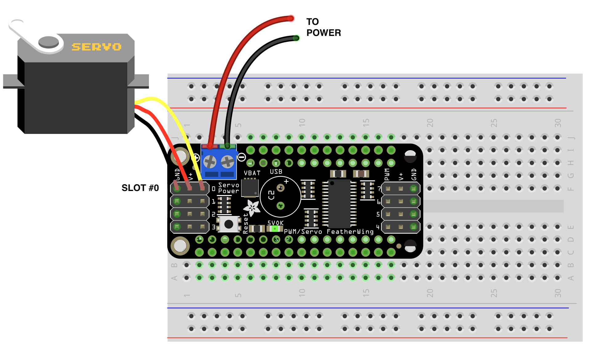

# Servos

A servomechanism is a little motor with a built-in sensor that can (somewhat) accurately rotate its arm to a specific position. It's the fundamental means of performing physical actions with microcontrollers, whether that's opening a container or flapping some wings. Additionally, there are "continuous rotation servos" which are just motors that can be turned at a specific speed.

To use servos with the ESP32, we need to use a second circuit board that stacks on top of it. This second board includes a PCA9685 chip, which controls the servos, and an interface so the ESP32 and PCA9685 can talk to each other. It also has various headers to attach and power the servos. This board plugs right into the top of the ESP32.

The ESP32 does not have enough power to run the servos itself, so we'll also need an external power supply, which can either be a 5v wall wart or a 4x AA battery pack. The leads from the power go into a small terminal on top of the servo board—use a small screwdriver to open and close the ports, **but be careful not to overtighten**.

Servos have three wires coming out; black/brown is ground, red/orange is power, and white/yellow is "PWM", so be sure to plug them in the right way on your board. There's a small number next to each slot—make note of where you plug your servo in.


	


Before we use the servo, we have to initialize it in the code, with `start_servos()`. We then initialize each servo we're going to use with the `Servo()` function, passing in the port number.

## Standard servos

Standard servos can rotate back and forth 180 degrees. In our code, we use the `.position()` method to set the position to what we want.


###### Code


```py
from esp_helper import *

start_servos() 			# start the servos

arm = Servo(0)			# set up a new servo, called "arm", plugged into slot 0

arm.position(0)			# move the arm all the way one way and then back again
arm.position(180)
arm.position(0)
```


## Continuous rotation servos

This type of servo is slightly different. The setup is the same, but in the code, we'll use the `.speed()` method to set the speed and direction of the servo. Instead of degrees, this method takes a number from -1 to 1 indicating how fast it should move relative to its top speed in either direction.

Note that with this kind of servo, once they get going, they keep going, even if your code ends. So it's good practice to use the `.stop()` method to stop it. And while in theory, setting the speed to 0 should also stop it, in practice, the servo might still move a bit if it's not exactly calibrated, so `.stop()` is good for that, too.

```py
from esp_helper import *

start_servos() 			# start the servos

wheel = Servo(0)		# set up a new continuous servo, called "wheel", plugged into slot 0

wheel.speed(1)			# go top speed in one direction, and then go in the other
sleep(1)

wheel.speed(-1)
sleep(1)

wheel.stop()			# stop the wheel
```

## Attaching things to servos

Ideas?


## Inkscape template

[servos.svg](cuts/servos.svg)


<!-- 

https://learn.adafruit.com/adafruit-8-channel-pwm-or-servo-featherwing

Errno 19 ENODEV means that the module couldn't find the I2C sensor

 -->
