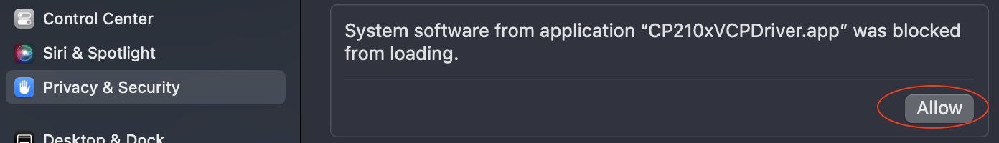
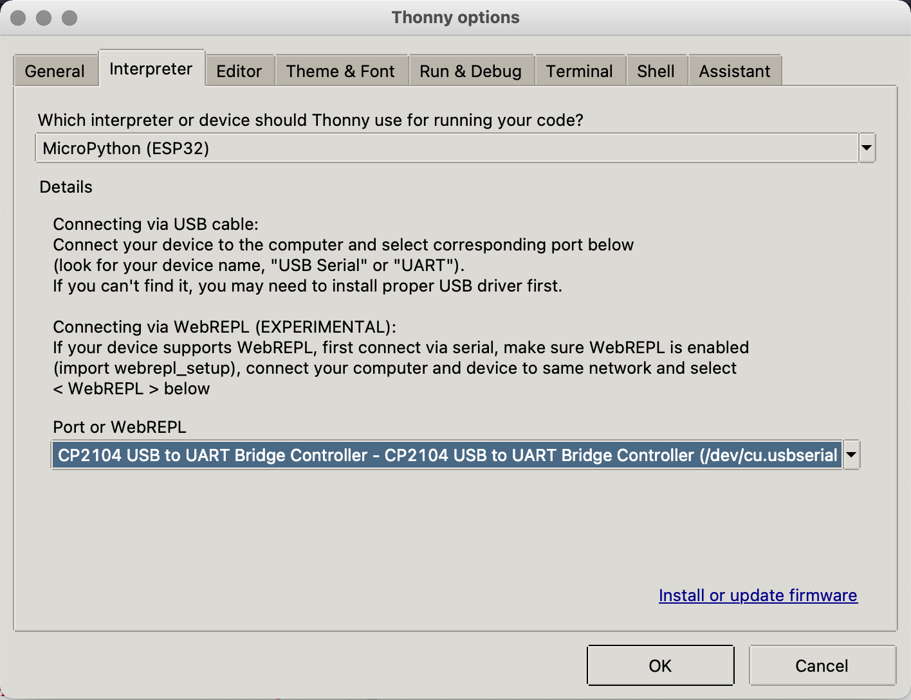
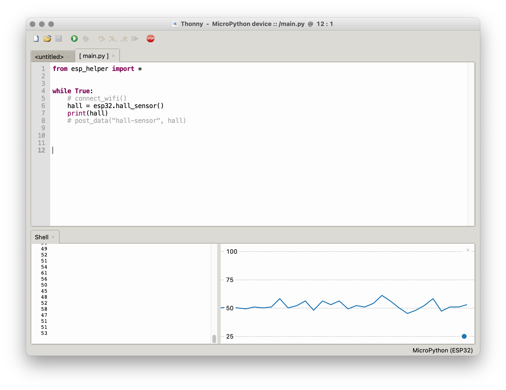

# <a name="setup"></a> Setup

To write code for our ESP32s, we will be using Micropython via the Thonny IDE and virtual COM port. 

## Driver

First, we have to download and install the [ESP driver](https://www.silabs.com/developers/usb-to-uart-bridge-vcp-drivers?tab=downloads) that will allow your machine to communicate with your ESP over a USB port. Download the driver that matches your operating system, open the .zip file, and launch the installer file inside. You may need to give the installer permission via your System Settings:

<p align="center">
  
</p>

When this is finished installing, **restart your machine**, and then plug in your ESP.

## Thonny

Next, download and install the [Thonny IDE](https://thonny.org). After opening the program, go to `Tools > Options` and choose `Interpreter`. Choose "MicroPython (ESP32)" for the interpreter, and find the UART Bridge Controller under "Port":

<p align="center">
  
</p>

You will need to have your ESP plugged in for this to work. After you've closed the dialog box, click the "Stop/Restart" stop sign button. In the console, you should see something like:
```
MicroPython v1.20 on 2023-04-26; ESP32 module with ESP32
Type "help()" for more information.
>>>
```

## Helper

Finally, go to [esp_helper.py](../esp/esp_helper.py) and copy the contents. Open Thonny and make a new file, and paste the contents into this file. Then choose `File > Save`, and select `MicroPython device`. Title the file `esp_helper.py` and save it. Once you've done this, close the file.

## Testing

##### Testing

Create a new file containing the following, and save it on your ESP as `main.py`:

```py
from esp_helper import *

while True:
    hall = esp32.hall_sensor()
    print(hall)
```

The hall sensor is a built-in sensor on the ESP which detects magnetic fields. This code will read data from the sensor and print it to console. Run it by clicking the green triangle. You should see a stream of numbers in the console ("Shell"). If you choose `View > Plotter`, you should see a constantly changing graph:

<p align="center">
  
</p>

Congratulations! You've made a sensor.

Note that this code is running on the ESP, not your computer—if you hook it up to a battery and disconnect it from your computer, it will still work.