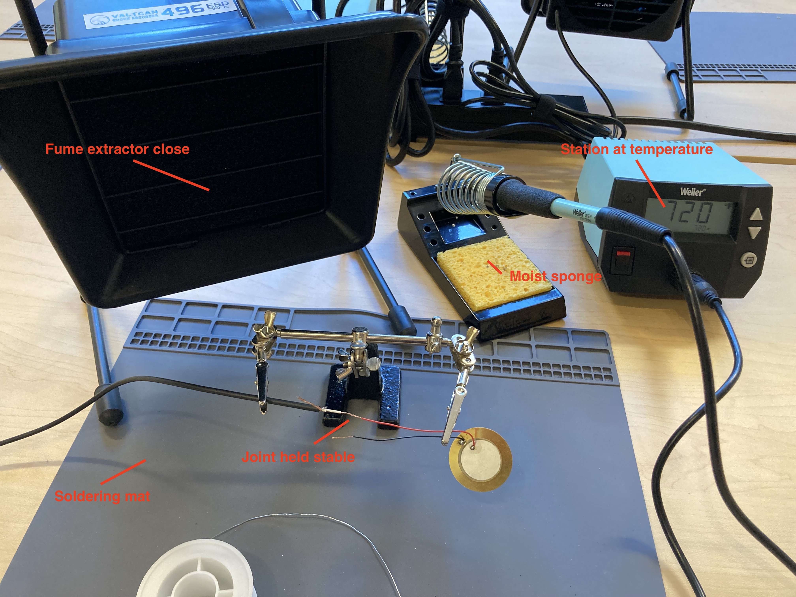

# Soldering

SAW-der

### Tools
- Soldering station
- Soldering mat
- Smoke extractor
- Helping hands
- Solder

## Safety

1. **DON'T TOUCH THE METAL PART—IT'S HOT AND IT WILL BURN YOU!**
1. If the soldering iron isn't in your hand, put it back in its holder—nowhere else!
1. Solder contains small amounts of lead, so don't solder if you are pregnant, and wash your hands afterwards.
1. Try not to breathe in the fumes.
1. Turn it off when you are done.

### If You Burn Yourself

#### Small burn
1. Keep the burn under cool running water for 5 minutes
1. Don't apply any creams or ointments
1. Cover with a bandaid to protect it

#### Something worse
1. Call 413-542-2111 and ACEMS will come to take a look at it

## Setup

1. Use a soldering mat or a cutting mat to protect the surface your working on
1. Wet the sponge so it is moist (not soaking wet) 
1. Position the fume extractor close to your working area so that it draws the fumes away
1. Prepare the joint (this will very depending on the situation)
1. Use the helping hands to hold the joint stable so that you have both hands free
1. Turn the soldering iron on and heat it to 720 degrees (the default)

## Soldering
1. First, "tin" the soldering iron. This simply means melt some solder all around the tip by touching solder all around the tip so that it melts and then wiping the iron on the sponge. The tip of the iron would be smooth and silvery without brown oxidation spots.
1. Hold the soldering iron still against **both** pieces of metal you are soldering together
1. Then, "feed" the solder into the joint between the pieces. It should freely flow into the joint. Pull from the spool of solder as you go.
1. If you are trying to "paint" the solder on with the soldering iron tip, stop doing that.
1. More solder!
1. If solder accumulates on the tip of the iron, wipe it on the sponge
1. Done? Taking a break? Put the soldering iron in its holder
1. Ready to start again? Make sure the temperature is still at 720 degrees. If not, hit the "up" arrow on the soldering station and wait until it gets up to temperature.
1. Done? TURN IT OFF.

