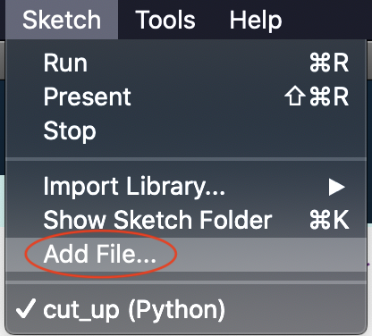
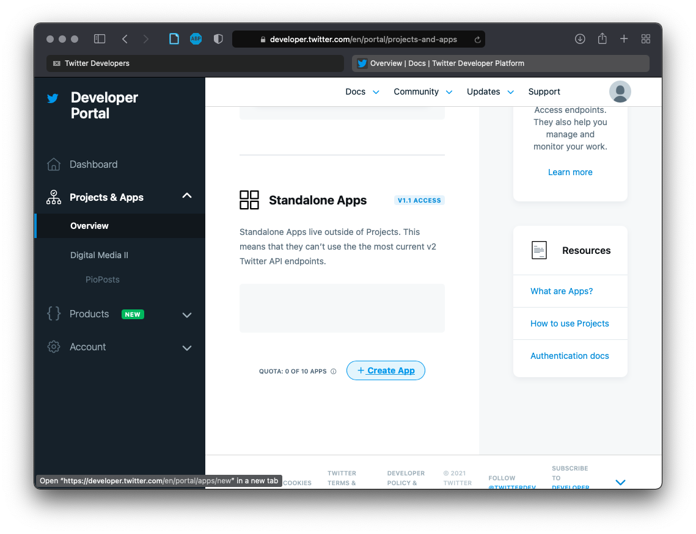
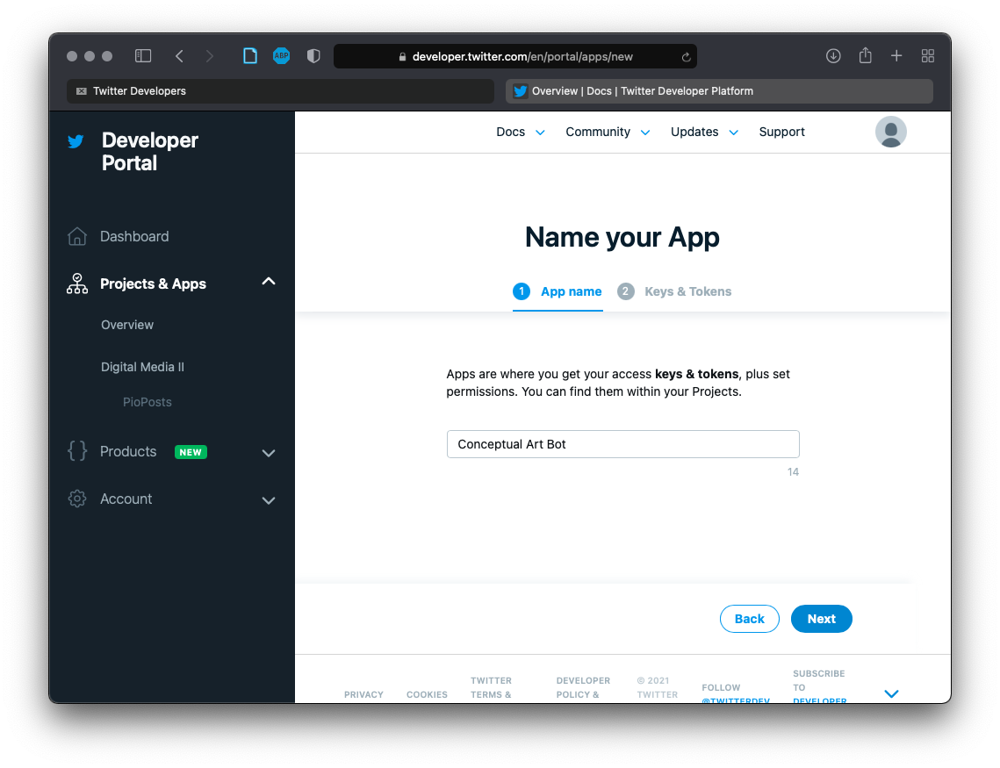
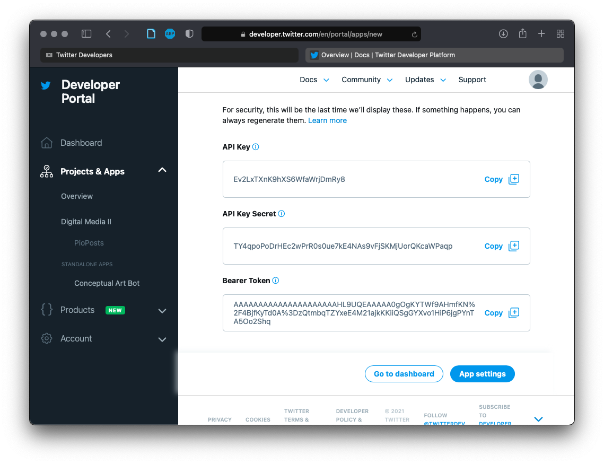
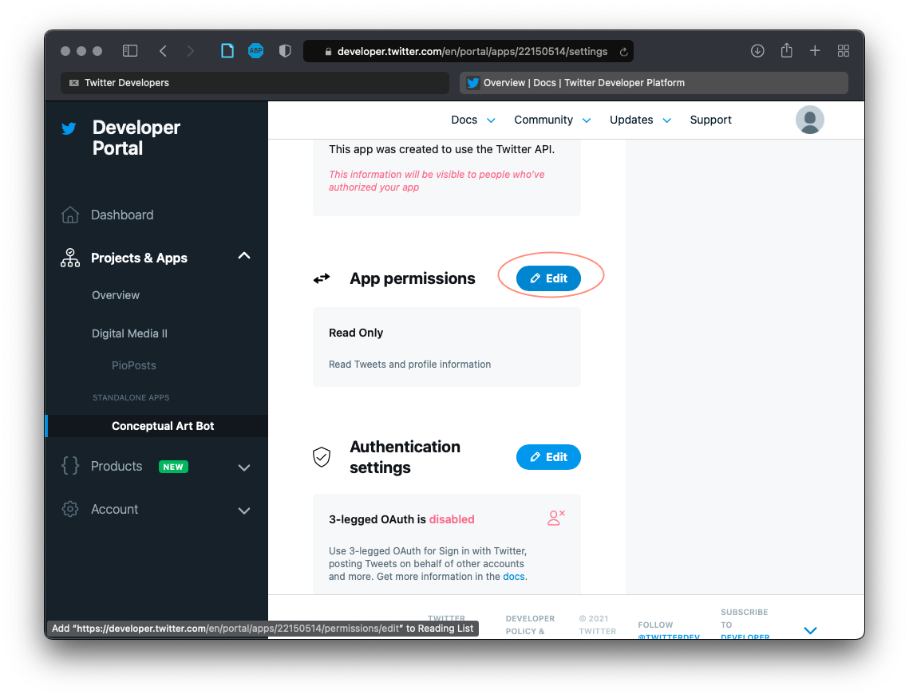
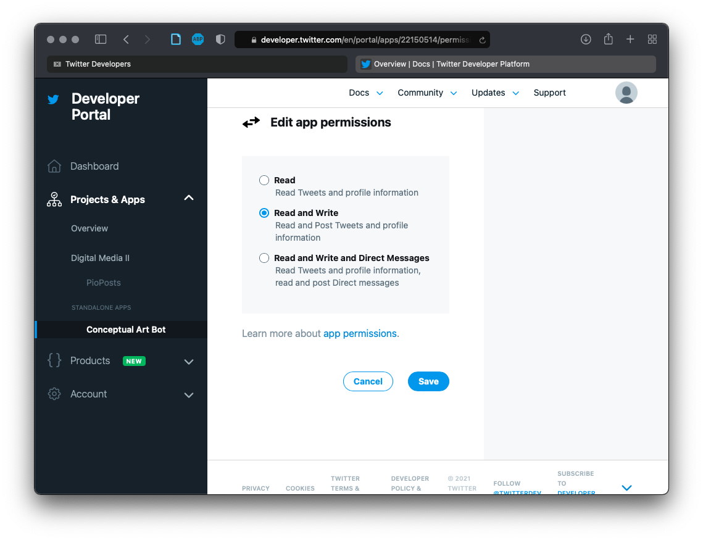
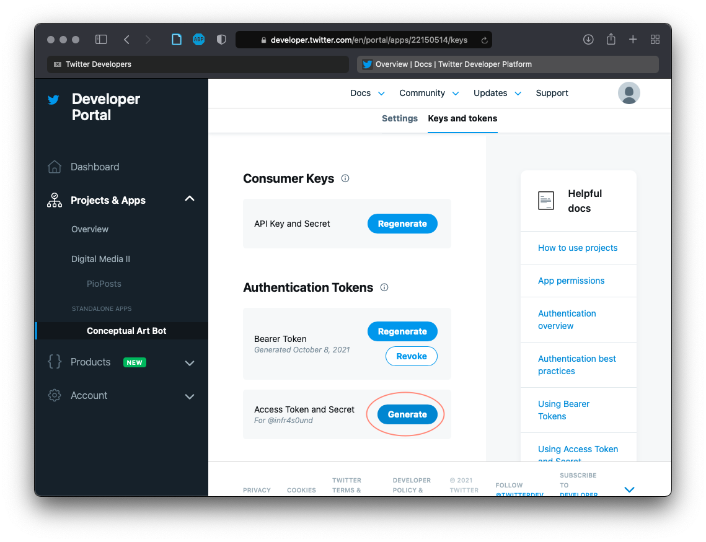
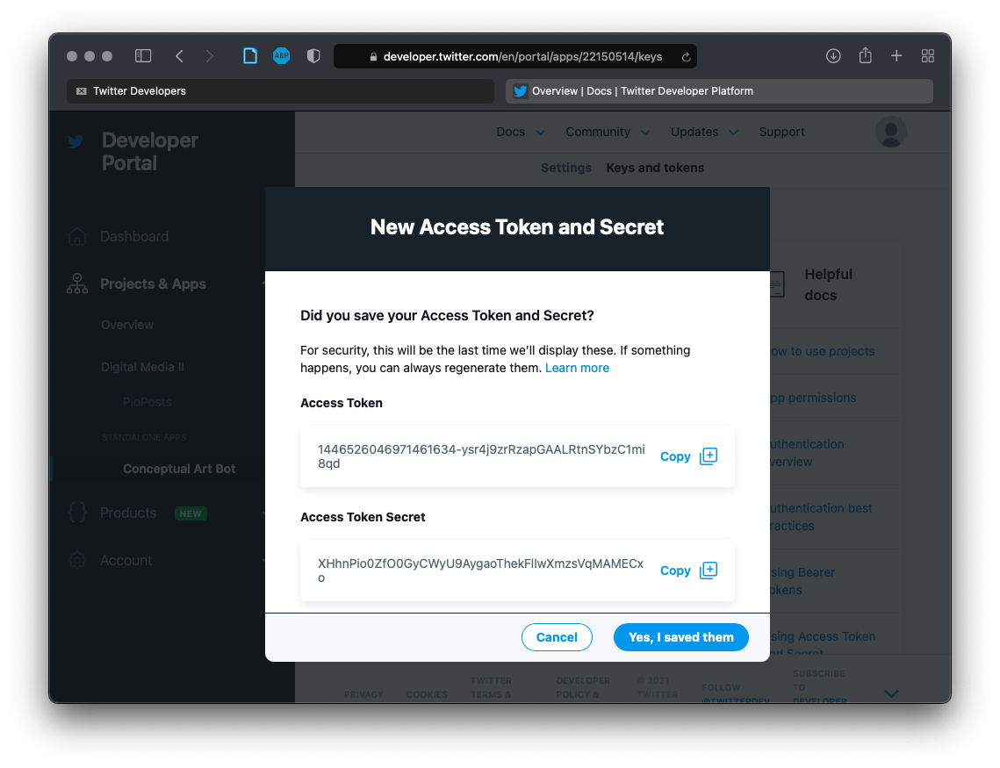

# Project #1: Social Automation

Much of the interaction that happens online is not between people, but between people and algorithms, or even between algorithms and algorithms. For example, huge platforms like Facebook, Google, and Twitter are constantly monitoring our activity and manipulating our feeds accordingly—and these platforms provide the environment for third-parties to attempt to game the system. From benign bots that tweet jokes to malicious fake followers that sow disinformation, we're not not alone out there.

For this project, you will create an experimental "Twitter Bot" using code. Your bot will maintain a presence online by automatically posting text and/or images, and it may interact socially by replying to others' comments. It may or may not be apparent to others that your bot is automated.

This is a 3-week project. Next week you will present a proposal of your idea to the class for feedback, and you will present your progress. The following week will be a crit. You must have a title and an underlying artistic concept articulated with a [3-sentence description](../../resources/description_guidelines.md) that you will present with the work.

Important: **You must have your bot up and running for at least 24-hours _prior_ to the crit.**

For your proposal, turn in a draft version of your title and description. Also include any references, links to other accounts bots, or text or images to fully explain your thinking.


## Conceptual References

Examples of artist-made Twitter bots (click on the name for the artists' portfolio sites):
- [Darius Kazemi](http://tinysubversions.com)
    - https://twitter.com/BodegaBot
    - https://twitter.com/moonshotbot
    - https://twitter.com/WhichOneBot
    - https://twitter.com/rapnamebot
    - https://twitter.com/EatenBot
- [Allison Parrish](https://www.decontextualize.com)
    - https://twitter.com/deepquestionbot
    - [@everyword](https://www.instarbooks.com/books/everyword.html)
- [Ramsey Nasser](https://nas.sr)
    - [Top Gun 555µhz](https://nas.sr/555µhz/)
- [Everest Pipkin](https://everest-pipkin.com) and Loren Schmidt
    - [Moth Generator](https://twitter.com/mothgenerator)
- Brian House and [Kyle McDonald](http://kylemcdonald.net)      
    - [Conversnitch](https://brianhouse.net/works/conversnitch/)
- https://twitter.com/greatartbot
- https://twitter.com/tinycarebot
- https://twitter.com/RedScareBot
- https://twitter.com/infinite_scream
- [Constant Dullart](https://www.constantdullaart.com/)
    - [_The Possibility of Raising an Army_](http://army.cheap), article in the [Guardian](https://www.theguardian.com/artanddesign/2015/nov/09/army-for-hire-the-artist-employing-ghost-soldiers-to-invade-facebook-constant-dullaart)


Assigned reading (with many more examples):
- Data & Society: [How to Think About Bots](https://points.datasociety.net/how-to-think-about-bots-1ccb6c396326)

Artist writing about how to make a good bot:
- Harry Josephine Giles, "[Some Strategies of Bot Poetics](https://harryjosephine.com/2016/04/06/some-strategies-of-bot-poetics/)"
- Darius Kazemi, "[Basic Twitter Bot Etiquette](http://tinysubversions.com/2013/03/basic-twitter-bot-etiquette/)"


## Code

For this project, we'll be writing code in Processing using Python, just like in Digital Media I. If you're new to Processing or have used p5 instead, you may want to [review how to get set up](https://github.com/brianhouse/ART112/blob/master/units/0_algorithm/getting_started.md).


### Getting set up with Processing

Additionally, we're going to need to need to add some library code in order to interface with Twitter's API. API stands for Application Programming Interface, and it's a way that your computer will communication with Twitter's servers in order to control your bot without using the normal web interface.

First, open a new sketch, and save it.

Next, remember that you can use Processing's "Add File..." menu option to add code, images, and data to your sketch:
<p align="center">
  
</p>

We're going to add two code libraries that will allow us to access the Twitter API. Download each of these and add them to your sketch (click "download" on the next page):
- [simpletweet.jar](social_automation_demo/code/simpletweet.jar)
- [twitter4j-core-4.0.7.jar](social_automation_demo/code/twitter4j-core-4.0.7.jar)

We'll also include some code that I've written to help us get up and running faster. Download this and add it to your sketch (click "raw" on the next page and then save the result as a python file):
- [twitter_helper.py](social_automation_demo/twitter_helper.py)

Finally, you may need some word lists. Download each of these and add them to your sketch (click "raw" on the next page and then save the result as a text file):
- [list_adjectives.txt](social_automation_demo/data/list_adjectives.txt)
- [list_interjections.txt](social_automation_demo/data/list_interjections.txt)
- [list_nouns.txt](social_automation_demo/data/list_nouns.txt)
- [list_nouns_plural.txt](social_automation_demo/data/list_nouns_plural.txt)
- [list_prepositions.txt](social_automation_demo/data/list_prepositions.txt)
- [list_pronouns.txt](social_automation_demo/data/list_pronouns.txt)
- [list_verbs_imperative.txt](social_automation_demo/data/list_verbs_imperative.txt)
- [list_verbs_present.txt](social_automation_demo/data/list_verbs_present.txt)
- [list_verbs_past.txt](social_automation_demo/data/list_verbs_past.txt)

<!-- (We will be working with language in ways similar to the "Recombination" unit in Digital Media I. You can review that [here](https://github.com/brianhouse/ART112/blob/master/units/5_recombination/code.md), and you may want to also include "word_helper.py" from that unit if you want to do more advanced operations.) -->

Once all of these files are in place, type these lines into your sketch, save it, and then run:

```py
from twitter_helper import *
init(SimpleTweet(this))

```
You should see the output:
```
Successfully loaded Twitter API
```
If you get an error instead, get help and we'll figure it out.


## Getting set up with Twitter

You'll need a [Twitter](https://twitter.com) account (even if you already have one, create a new one for this project). Sign up using your lclark.edu email address by clicking the "Sign up with Google" option. The Twitter handle you choose will be the name of your bot. Choose something now, but don't worry, you can change it later.

After you create an account, send me the handle so I can add you to our developer team. You should then receive an invite in your email. Accept the invite—you'll have to agree to terms and conditions, and then you'll be taken to the [Twitter developer portal](https://developer.twitter.com/en/portal/dashboard).

Next, you'll create a "Standalone App":

<p align="center">
  
</p>

Give your app a name:

<p align="center">
  
</p>

Click next, and you'll be shown a screen with some long key strings. We'll need to use the "API Key" and the "API Key Secret" in our program. Copy these two strings and paste them into your sketch as shown:

<p align="center">
  
</p>

```py
from twitter_helper import *
init(SimpleTweet(this))

api_key("XXXXXXXXXXXXXXXXXXXXXXXXX")
api_key_secret("XXXXXXXXXXXXXXXXXXXXXXXXXXXXXXXXXXXXXXXXXXXXXXXXXX")
```


After continuing to settings, and scroll down to "App Permissions". We need to change this to "Read and Write" in order to post tweets with our bots. Go ahead and make that change and save it:


<p align="center">
  
</p>

<p align="center">
  
</p>

Next, go to the tab "Keys and tokens". Under the "Authentication Tokens" section will be a button to generate an "Access Token and Secret":

<p align="center">
  
</p>

Click "Generate":

<p align="center">
  
</p>

```py
from twitter_helper import *
init(SimpleTweet(this))

api_key("XXXXXXXXXXXXXXXXXXXXXXXXX")
api_key_secret("XXXXXXXXXXXXXXXXXXXXXXXXXXXXXXXXXXXXXXXXXXXXXXXXXX")
access_token("XXXXXXXXXXXXXXXXXXXXXXXXXXXXXXXXXXXXXXXXXXXXXXXXXX")
access_token_secret("XXXXXXXXXXXXXXXXXXXXXXXXXXXXXXXXXXXXXXXXXXXXXXXXXX")
```

Once you've copied and pasted these strings into new variables in your sketch, go ahead and click "Yes, I saved them."

All of these settings and "tokens" and "secrets" are security measures to make sure that the app you're going to write is indeed authorized to make posts to Twitter and not some malicious virus taking over your account. It's a pain, but it's also important, and APIs other than Twitter will have their own similar procedures for getting set up. However, if all goes well here, we won't need to access any of this stuff again.


## Interfacing with Twitter

### Tweeting

Now that we have everything set up—phew—we're ready to post a tweet:

```py
from twitter_helper import *
init(SimpleTweet(this))

api_key("XXXXXXXXXXXXXXXXXXXXXXXXX")
api_key_secret("XXXXXXXXXXXXXXXXXXXXXXXXXXXXXXXXXXXXXXXXXXXXXXXXXX")
access_token("XXXXXXXXXXXXXXXXXXXXXXXXXXXXXXXXXXXXXXXXXXXXXXXXXX")
access_token_secret("XXXXXXXXXXXXXXXXXXXXXXXXXXXXXXXXXXXXXXXXXXXXXXXXXX")

post("Hello World!")
```
If you look at your bot's Twitter account, you should see the tweet. Congratulations, you've made a Twitter bot!

### Searching

Next, let's do a search for recent tweets about ... bagels.
```py
# From now on, the examples won't include the setup lines
# that always go at the beginning of your sketch

tweets = search("bagel")
```
This line will search for recent tweets that include the term "bagel" and return a list of tweets.

To see how many, we can use `len` to get the length of the list, and `print` to print it to the console:
```py
tweets = search("bagel")
print(len(tweets))
```
```
100
```
So we have a list of 100 tweets. To take a closer look at one, we can use the random `choice()` function as well as a special function called `print_tweet()` that will make things more legible:
```py
tweets = search("bagel")
tweet = choice(tweets)
print_tweet(tweet)
```
```
{
    "hashtags": [],
    "user_name": "Bagel",
    "url": "https://twitter.com/BagelBot_/statuses/1481756975230717953",
    "user_followers": 59,
    "is_quote": null,
    "user_follows": 46,
    "mentions": [],
    "replies_to": null,
    "links": [],
    "id": "1481756975230717953",
    "text": "can i eat a bagel even though thats cannibalism because im a bagel",
    "time": "Thu Jan 13 14:36:07 PST 2022",
    "retweets": 0,
    "user": "BagelBot_",
    "likes": 0
}
```
As you can see, a "tweet" is actually a dictionary with all kinds of different fields that are metadata about the tweet itself, including the number of likes and the account of the person who tweeted it (if you copy and paste the "url" into a browser, you can see how it looks on Twitter itself).

(Remember, to work with any of these dictionary fields in your code, you can write something like `tweet['likes']`, for example.)

### Likes and Retweets

Speaking of likes (or favorites, whatever), let's like a tweet:
```py
tweets = search("bagel")
tweet = choice(tweets)
print_tweet(tweet)

like(tweet)
```
If we go online and look at our bot's Twitter account under likes, we'll see this random tweet that our bot has liked. Nice!

What about a retweet?
```py
tweets = search("bagel")
tweet = choice(tweets)
print_tweet(tweet)

retweet(tweet)
```

Now, the tweet will show up on our bot's feed.

### Advanced Tweets: Replies and Quotes

To raise the stakes a bit, let's reply to a tweet:
```py
tweets = search("bagel")
tweet = choice(tweets)
print_tweet(tweet)

reply(tweet, "I like bagels, too!")
```

This is an inane and harmless response, but remember that this code has real-world consequences. Somewhere, someone has just received a notification about what our bot has said. This is different than simply coding on our own machines!

We can also do a "quote tweet" which is a tweet of our own, not a retweet, but which references another:
```py
tweets = search("bagel")
tweet = choice(tweets)
print_tweet(tweet)

quote(tweet, "I like bagels, too!")
```

### Following and the Timeline

To follow a user, we need their screen name. We can get that from a tweet, like this:
```py
tweets = search("bagel")
tweet = choice(tweets)
print_tweet(tweet)

user = tweet['user']
follow(user)
```

Alternately, we can follow people explicitly:
```py
follow("@Beyonce")
```

Once we're following a few people, we can pull the recent tweets from all of them, aka the "timeline", like this:

```py
tweets = timeline()
for tweet in tweets:
    print_tweet(tweet)
```

Notice how we've used the `for item in list` loop format to iterate through all of the tweets on our timeline and print them to the console.

This may be useful if we want to assemble a list of particular public figures, for example, or a group of people interested in a particular subject.


### Assembling Text

Similar to what we did in Recombination, we may want to assemble our tweets from word lists. Just like MadLibs, this will let us provide structure but randomize some of the details.

Here's how to load one of the word lists that we've added to our sketch:
```py
nouns = open("list_nouns.txt").read().split()
```
To then get a random noun, we use `choice()`:
```py
choice(nouns)
```
So, making a full sentence and tweeting it might go something like this:
```py
# load lists (only do this once at the beginning)
nouns = open("list_nouns.txt").read().split()
adjectives = open("list_nouns.txt").read().split()
imperatives = open("list_verbs_imperative.txt").read().split()
pasts = open("list_verbs_past.txt").read().split()
interjections = open("list_interjections.txt").read().split()

# assemble sentence
text = choice(interjections).title() + "! The " + choice(nouns) + " has " + choice(pasts) + " the " + choice(nouns) + "!"
print(text)

# tweet it out!
post(text)
```

This word lists are general purpose. But keep in mind that you can make your own!

### Posting Images

Since we're working in Processing, a natural thing to want to do is to tweet a an image, whether that is a preexisting static image or one that we code dynamically. This is where the `post_iamge()` function comes in, which will post the contents of the canvas to Twitter along with a specified message.

To tweet an image file, for example, first we use "Add File..." to include it in our sketch. Then we use Processing functions to display it like we would in any other sketch. Finally, we use `post_image()` to make it happen:

```py
size(400, 400)
puffin = loadImage("puffin.png")
image(puffin, 0, 0)

post_image("This is a puffin")
```

If we want to make a generative image and post that instead, we can do it like this:
```py
size(400, 400)
for i in range(20):
    fill(random(255), random(255), random(255))
    square(random(400), random(400), random(200))

post_image("This is not a puffin")
```

### Using Properties

A slightly more nuanced example of how you might have your bot interact with the social context of Twitter is to search for a particular hashtag, harvest the links that have been shared with that hashtag, and repost the links with new, randomly generated captions.

First, let's search for "#climatecrisis" and print out the number of results that we get back, just so we know what's going on:
```py
tweets = search("#climatecrisis")
print(len(tweets))
```

Now, let's go through each of the tweets using a `for` loop. We can get the list of links included in each tweet (if there are any) by using `tweet['links']`. We can then print these out as well:
```py
tweets = search("#climatecrisis")
print(len(tweets))
for tweet in tweets:
    for link in tweet['links']:
        print(link)

```
```
100
https://thepeoplesmanifesto.blogspot.com
https://twitter.com/sssmaldo/status/1482016511229407237
https://youtu.be/-v3XzTp3TAg
https://twitter.com/kodisimus/status/1482041246864621569
https://youtu.be/c9q4FmJPcNc
https://religionnews.com/2022/01/13/ahead-of-jewish-earth-day-more-jewish-institutions-claim-movement-on-climate-action/
https://thepeoplesmanifesto.blogspot.com
https://twitter.com/energyx/status/1482040887618285574
https://twitter.com/DrMegWhitman/status/1482040873864990720
https://twitter.com/SenSanders/status/1481984470160977921
https://twitter.com/ayocaesar/status/1478699765592432641
https://phys.org/news/2022-01-americans-alarmed-climate-leaders.html
https://twitter.com/MaryHeglar/status/1481706383435255808
https://twitter.com/stevebakerhw/status/1482030064665567239
https://www.theguardian.com/environment/2022/jan/13/record-number-americans-alarmed-about-climate-crisis?CMP=Share_iOSApp_Other
https://twitter.com/VFPNational/status/1479594811585753093
https://braveneweurope.com/reuters-eu-court-rejects
https://twitter.com/insideclimate/status/1482024710426836995
https://braveneweurope.com/bloomberg-german-natural-gas
https://braveneweurope.com/george-monbiot-the-tipping-point-that-will-destroy-the-world
https://braveneweurope.com/renegade-inc-shannon-walsh-the
https://twitter.com/ImmyKaur/status/1481991421905227776
https://twitter.com/stopthespraybc/status/1482026581597966336
https://twitter.com/FossilFreeWYPF/status/1482002132991721474
https://twitter.com/thisworthing/status/1482029014697054217
https://youtu.be/TW7bO23nAjE
https://twitter.com/ClimateReality/status/1482032026312228865
https://twitter.com/ipri_pak/status/1482037293103910915
```

This is now a potentially useful list of links having to do with the climate crisis. Notice, however, that many of them are links to other Twitter posts. These are quotes. If we don't want these, we can filter them out using `tweet['is_quote']` and an `if` statement:
```py
tweets = search("#climatecrisis")
print(len(tweets))
for tweet in tweets:
    if tweet['is_quote'] is False:
        for link in tweet['links']:
            print(link)
```
```
https://youtu.be/-v3XzTp3TAg
https://share.newsbreak.com/c8478lz5
https://youtu.be/-v3XzTp3TAg
https://www.theguardian.com/australia-news/2022/jan/13/hottest-day-on-record-in-parts-of-western-australia-as-temperature-reaches-50c
https://www.heraldnet.com/life/regenerative-gardening-helps-save-the-planet-one-garden-at-a-time/
https://twitter.com/kodisimus/status/1482041246864621569
http://www.iguanabooks.ca/books/beyond-what-separates-us
https://share.newsbreak.com/c8478lz5
https://www.theguardian.com/books/2022/jan/14/amitav-ghosh-european-colonialism-helped-create-a-planet-in-crisis
https://thepeoplesmanifesto.blogspot.com
https://youtu.be/-v3XzTp3TAg
https://youtu.be/c9q4FmJPcNc
https://religionnews.com/2022/01/13/ahead-of-jewish-earth-day-more-jewish-institutions-claim-movement-on-climate-action/
https://thepeoplesmanifesto.blogspot.com
https://phys.org/news/2022-01-americans-alarmed-climate-leaders.html
```
Now our links are all external to Twitter. Rather than printing them out, let's store them in a list:
```py
links = []
tweets = search("#climatecrisis")
print(len(tweets))
for tweet in tweets:
    if tweet['is_quote'] is False:
        for link in tweet['links']:
            links.append(link)

```
Now we can do something with them. For example, let's pick a random one and use it to make our own tweet:

```py
link = choice(links)
post("People get ready: " + link)
```

### Rate Limiting

Rather than choosing one link and making one tweet in the previous example, why not use a loop and tweet every link? We _could_ do that. But posting too many things at once is usually a bad idea with Twitter. For one thing, that's not how a person would tweet, and we want our bots to reasonably approximate a human user. But secondly, there is also something called rate limiting.

Unless we pay a lot of money, Twitter only allows a certain amount of calls to their API within a given amount of time. The policy is explained [here](https://developer.twitter.com/en/docs/twitter-api/v1/rate-limits). So we have to be judicious how many times we post or search. It's usually not a problem, but if we have things within a loop, it quickly can be.

The general rule is this: **don't use Twitter functions within a loop**.


### Time and Automation

So far, all of our examples have run once when we run the sketch. But that's not how a bot works—it needs to run continuously as an automatic process.

To do this, first we'll put all of our code within a function, like this:

```py
from twitter_helper import *
init(SimpleTweet(this))

api_key("XXXXXXXXXXXXXXXXXXXXXXXXX")
api_key_secret("XXXXXXXXXXXXXXXXXXXXXXXXXXXXXXXXXXXXXXXXXXXXXXXXXX")
access_token("XXXXXXXXXXXXXXXXXXXXXXXXXXXXXXXXXXXXXXXXXXXXXXXXXX")
access_token_secret("XXXXXXXXXXXXXXXXXXXXXXXXXXXXXXXXXXXXXXXXXXXXXXXXXX")

size(400, 400) # size() stays outside the function

def run():
    background(255)
    for i in range(20):
        fill(random(255), random(255), random(255))
        square(random(400), random(400), random(200))    
    post_image("A new generative drawing")
```

Notice that `size()` stays outside of the function, because Processing only lets us call it once, and that we're using `background()` to clear the canvas every time we use this function.

Now, we're going to add the mechanism to put this on a timer. Remember when I said not to call Twitter functions inside of a loop? This is the only exception.

```py
from twitter_helper import *
init(SimpleTweet(this))

api_key("XXXXXXXXXXXXXXXXXXXXXXXXX")
api_key_secret("XXXXXXXXXXXXXXXXXXXXXXXXXXXXXXXXXXXXXXXXXXXXXXXXXX")
access_token("XXXXXXXXXXXXXXXXXXXXXXXXXXXXXXXXXXXXXXXXXXXXXXXXXX")
access_token_secret("XXXXXXXXXXXXXXXXXXXXXXXXXXXXXXXXXXXXXXXXXXXXXXXXXX")

size(400, 400) # size() stays outside the function

def run():
    background(255)
    for i in range(20):
        fill(random(255), random(255), random(255))
        square(random(400), random(400), random(200))    
    post_image("A new generative drawing")

while True:
    run()
    time.sleep(10*60) # 10 minutes * 60 seconds per minute
```
We haven't seen `while` before, but it's another way of constructing a loop. `while True` is just a quick way of writing "infinite loop". So anything in this code block is going to repeat forever (or until you stop the sketch).

`time.sleep()` pauses the code for a given number of seconds. In this case, we setting it to 10 times 60, or 600, which is 10 minutes. So every 10 minutes, `run()` will be called and this sketch will post an image to Twitter.

And there it is. That's how you make an automated Twitter bot.


## Additional Examples

Grabbing images from tweets, glitching them, and reposting:

```py
from twitter_helper import *
init(SimpleTweet(this))

api_key("XXXXXXXXXXXXXXXXXXXXXXXXX")
api_key_secret("XXXXXXXXXXXXXXXXXXXXXXXXXXXXXXXXXXXXXXXXXXXXXXXXXX")
access_token("XXXXXXXXXXXXXXXXXXXXXXXXXXXXXXXXXXXXXXXXXXXXXXXXXX")
access_token_secret("XXXXXXXXXXXXXXXXXXXXXXXXXXXXXXXXXXXXXXXXXXXXXXXXXX")

size(640, 480)

def run():        
    # search for tweets
    tweets = search("#pizza OR #bagels")

    # get a list of the tweets that have images
    tweets_with_images = []    
    for tweet in tweets:
        if tweet['image'] is not None:
            tweets_with_images.append(tweet)

    # pick one
    tweet = choice(tweets_with_images)

    # load the image from twitter
    source = loadImage(tweet['image'])

    # resize the image so it fills your canvas
    source.resize(width, height)

    # glitch away
    # https://github.com/brianhouse/ART112/blob/master/units/6_glitch/code.md
    background(0)
    offset = 50
    for y in range(height):
        for x in range(width):    
            pixel_1 = source.get(x, y)
            r_1 = red(pixel_1)
            g_1 = green(pixel_1)
            b_1 = blue(pixel_1)    
            pixel_2 = source.get(x + offset, y)
            r_2 = red(pixel_2)
            g_2 = green(pixel_2)
            b_2 = blue(pixel_2)    
            stroke(r_1, g_2, b_2)   
            point(x, y)     

    # (alternately, you can just show the image)
    # image(source, 0, 0)

    # post to twitter
    post_image("This is my glitch version")

run()        
```
